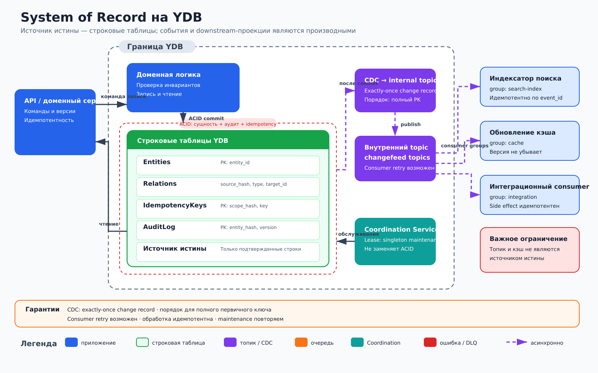

# System of Record на YDB

## Назначение

Архитектура хранит каноническое состояние домена в строковых таблицах YDB. Единственный источник истины — `Entities` и `Relations`; топик изменений, кэши и представления нижестоящих систем восстанавливаются из них и не принимают доменные решения вместо API.

## Когда применять

- Для мастер-данных, профилей, каталогов и других доменов, где требуется строгая транзакционная запись.
- Когда несколько получателей должны независимо реагировать на подтвержденные изменения.
- Когда аудит и повтор запроса должны быть частью одной ACID-транзакции.

## Компоненты

- Внешний **API / доменный сервис** проверяет команды и выполняет транзакции.
- Строковые таблицы YDB: `Entities` с PK `(entity_hash, entity_id)`, `Relations` с PK `(source_hash, source_id, relation_type, target_id)`, `IdempotencyKeys` с PK `(scope_hash, scope, idempotency_key)`, `AuditLog` с PK `(entity_hash, entity_id, version)`. Hash-поля — только распределяющие префиксы; исходные идентификаторы остаются в ключах.
- **CDC / поток изменений (changefeed)** для `Entities` и `Relations` создает одну запись об изменении на каждое зафиксированное изменение строки во внутреннем Topic потока изменений соответствующей таблицы. Порядок сохраняется для одного полного первичного ключа.
- Внешние приложения-проекторы читают Topics как именованные **YDB Consumer `search-index`**, **YDB Consumer `cache`** и **YDB Consumer `integration`**. Смещение (offset) каждого YDB Consumer хранится по партициям.
- **Coordination Service** внутри YDB выдает аренду (lease) внешнему обслуживающему процессу для очистки истекших ключей и проверки целостности.

## Основной поток

1. Клиент отправляет команду с `idempotency_key` в API.
2. Сервис читает `IdempotencyKeys`; повтор возвращает ранее сохраненный результат.
3. В одной ACID-транзакции сервис изменяет `Entities` и `Relations`, добавляет запись в `AuditLog` и фиксирует ключ в `IdempotencyKeys`.
4. После фиксации CDC создает одну запись об изменении на каждое зафиксированное изменение строки во внутренних Topics потока изменений `Entities/entity-changes` и `Relations/relation-changes`.
5. Внешние проекторы читают журнал от имени соответствующих именованных YDB Consumer, идемпотентно обновляют проекции и подтверждают смещение по партициям.
6. Чтение актуального состояния выполняется из строковых таблиц через API; производные представления допустимы только для ослабленно согласованных сценариев.

## Согласованность и надежность

Граница атомарности — одна транзакция YDB над строковыми таблицами. CDC создает одну запись об изменении на каждое зафиксированное изменение строки во внутреннем Topic потока изменений и сохраняет порядок для одного полного первичного ключа. После сбоя чтение YDB Consumer с последнего подтвержденного смещения и прикладная обработка могут повториться, поэтому проектор применяет запись идемпотентно по полному ключу, версии и метаданным изменения. Глобальный порядок между разными ключами не предполагается.

Coordination Service не заменяет ACID-транзакции и не защищает доменные инварианты. Любой внешний побочный эффект — HTTP-вызов, письмо или изменение внешней системы — требует идемпотентности и не считается атомарным с фиксацией в YDB.

## Масштабирование и ключи партиционирования

`entity_hash`, `source_hash` и `scope_hash` равномерно распределяют нагрузку, но не заменяют идентичность. Полные ключи сохраняют `entity_id`, `source_id`, `scope` и остальные доменные части: `(entity_hash, entity_id)`, `(source_hash, source_id, relation_type, target_id)`, `(scope_hash, scope, idempotency_key)`, `(entity_hash, entity_id, version)`. Монотонная временная метка не должна быть первым ключом. Поток изменений следует полному PK исходной таблицы. API и проекторы масштабируются горизонтально.

## Отказы и восстановление

При неопределенном результате фиксации клиент повторяет запрос с тем же ключом. YDB Consumer после сбоя продолжает с подтвержденного смещения по партициям и может повторно передать запись в прикладную обработку. Отставание именованных YDB Consumer и ошибки потока изменений наблюдаются отдельно. Потерянная нижестоящая проекция пересобирается из таблиц или повторным чтением журнала в пределах срока хранения. Внешний обслуживающий процесс возобновляет работу с новой арендой Coordination Service; операции обслуживания обязаны быть повторяемыми.

## Ограничения и антипаттерны

- Нельзя считать топик, кэш или поисковый индекс источником истины.
- Нельзя публиковать событие до фиксации или выполнять внешний побочный эффект внутри расчета на «общую транзакцию».
- Нельзя использовать Coordination Service как распределенную замену проверкам версий и ACID.
- Нельзя создавать горячую партицию монотонными ключами или использовать hash вместо исходной идентичности.
- Архитектура описывает только строковые таблицы и транзакционные нагрузки.
