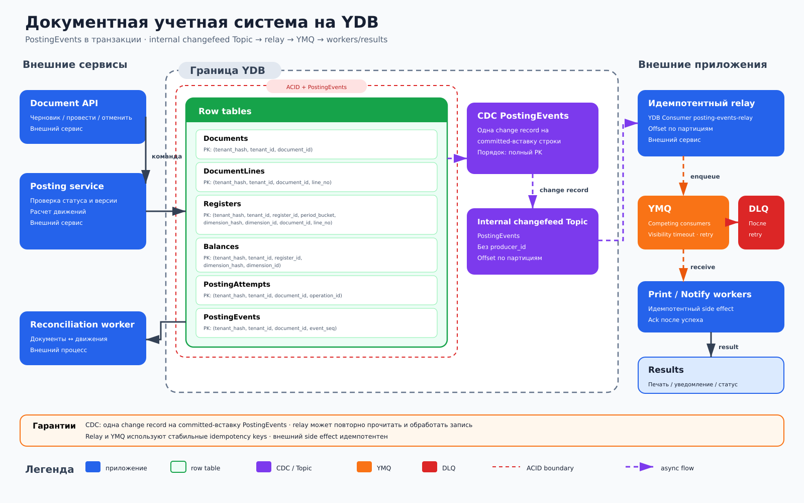

# Документная учетная система на YDB

## Назначение

Архитектура реализует жизненный цикл учетного документа: черновик, атомарное проведение и отмену. Строковые таблицы `Documents` и `DocumentLines` хранят первичный документ, `Registers` — движения, а `Balances` — оперативные остатки. Проведение защищено от повторного применения.

## Когда применять

- Для складского, товарного или управленческого учета с документами и движениями по регистрам.
- Когда движения и остатки должны изменяться атомарно с состоянием документа.
- Когда печать, уведомления и интеграции допустимо выполнять асинхронно после commit.

## Компоненты

- Внешний **Document API** создает и редактирует черновики, запускает проведение и отмену.
- Строковые таблицы YDB: `Documents` с PK `(tenant_hash, tenant_id, document_id)`, `DocumentLines` с PK `(tenant_hash, tenant_id, document_id, line_no)`, `Registers` с PK `(tenant_hash, tenant_id, register_id, period_bucket, dimension_hash, dimension_id, document_id, line_no)`, `Balances` с PK `(tenant_hash, tenant_id, register_id, dimension_hash, dimension_id)`, `PostingAttempts` с PK `(tenant_hash, tenant_id, document_id, operation_id)`, `PostingEvents` с PK `(tenant_hash, tenant_id, document_id, event_seq)`. Hash-поля — распределяющие префиксы, а не identity.
- Внешний **Posting service** проверяет версию и статус, рассчитывает движения и выполняет одну ACID-транзакцию.
- **`PostingEvents`** — append-only row table: posting service атомарно с проведением добавляет доменное событие, поэтому changefeed не должен фильтровать изменения `Documents` по `status=POSTED`.
- **CDC `PostingEvents`** создает одну change record на каждую committed-вставку строки во внутреннем changefeed Topic и сохраняет порядок для полного PK `(tenant_hash, tenant_id, document_id, event_seq)`.
- Внешний идемпотентный relay читает Topic как **YDB Consumer `posting-events-relay`**; его offset хранится по партициям. Relay ставит задания в YMQ.
- **Yandex Message Queue (YMQ)** / SQS-подобная очередь используется для печати и уведомлений: competing consumers, visibility timeout, retry и DLQ. Это отдельный сервис поверх YDB, а не встроенный объект YDB.
- Внешний **Reconciliation worker** сверяет документы, движения и остатки.

## Основной поток

1. API записывает `Documents` со статусом `DRAFT` и строки в `DocumentLines`.
2. Клиент передает `operation_id`; posting service читает документ и строки, проверяет статус, версию и существующий `PostingAttempts`.
3. В одной ACID-транзакции создается попытка, добавляются движения в `Registers`, изменяются затронутые строки `Balances`, документ переводится в `POSTED` и добавляется строка `PostingEvents`.
4. Повтор с тем же `operation_id` возвращает сохраненный результат; попытка повторно провести уже проведенный документ не создает движений.
5. После commit CDC создает одну change record на committed-вставку `PostingEvents` во внутреннем changefeed Topic.
6. Relay читает запись как YDB Consumer `posting-events-relay` и идемпотентно формирует задания печати и уведомлений в YMQ; чтение и обработка после сбоя могут повториться. Workers подтверждают задания после успешного внешнего side effect.
7. Отмена выполняется отдельной транзакцией: добавляются обратные движения, корректируются остатки, создается попытка отмены, статус становится `CANCELLED`; исходные движения не удаляются.

## Согласованность и надежность

Документ, движения, остатки, `PostingEvents` и защита от повторного проведения фиксируются одной транзакцией. Конфликтующие изменения одного остатка разрешаются optimistic retry с повторным расчетом. CDC создает одну change record на каждую committed-вставку `PostingEvents` и упорядочивает записи одного полного PK. При восстановлении YDB Consumer `posting-events-relay` чтение и прикладная обработка могут повториться, поэтому relay дедуплицирует по `(tenant_hash, tenant_id, document_id, event_seq)`. YMQ также может повторно выдать задание; для него используется стабильный `job_id`.

YMQ применяет competing consumers, visibility timeout, ограниченные retry и DLQ; попадание в DLQ не отменяет проведенный документ. Внешний side effect требует идемпотентности. Если для запуска сверки применяется Coordination Service, он только выбирает исполнителя и не заменяет ACID.

## Масштабирование и ключи партиционирования

`tenant_hash` и `dimension_hash` только распределяют нагрузку; полные identity сохраняются в PK вместе с `tenant_id`, `document_id` и `dimension_id`. `DocumentLines` группируется по `(tenant_hash, tenant_id, document_id)`. `Registers` помещает временной bucket после tenant identity и сохраняет `(dimension_hash, dimension_id)`. `Balances` использует `(tenant_hash, tenant_id, register_id, dimension_hash, dimension_id)`. Внутренний changefeed Topic `PostingEvents` следует полному PK `(tenant_hash, tenant_id, document_id, event_seq)`. Если нужен прикладной YDB Topic с порядком документов, relay публикует с `producer_id = message_group_id = document_id`; порядок гарантирован только внутри этого `producer_id`. YMQ workers масштабируются числом competing consumers.

## Отказы и восстановление

Неопределенный ответ commit обрабатывается повтором с тем же `operation_id`. Зависшая попытка различается по итоговому статусу документа и записи `PostingAttempts`, а не по таймеру клиента. После сбоя YDB Consumer `posting-events-relay` возобновляет чтение с подтвержденного offset по партициям и может повторно обработать запись, поэтому enqueue идемпотентен. Истекший visibility timeout возвращает задание YMQ другому worker; после лимита retry оно попадает в DLQ для разбора и повторной постановки. Сверка пересчитывает ожидаемые движения и остатки диапазонами, записывает расхождения и инициирует контролируемую корректировку новой транзакцией.

## Ограничения и антипаттерны

- Нельзя сначала менять статус, а затем отдельными транзакциями записывать движения и остатки.
- Нельзя ожидать, что changefeed `Documents` сам отфильтрует только переходы в `POSTED`; доменное событие материализуется строкой `PostingEvents`.
- Нельзя удалять движения при отмене: нужны компенсирующие записи с трассировкой исходного документа.
- Нельзя использовать YDB Topic как competing-consumer очередь или называть YMQ встроенным объектом YDB.
- Нельзя считать доставку задания гарантией выполнения внешнего side effect без идемпотентного ключа.
- Нельзя ставить timestamp первым ключом регистра или удерживать распределенную блокировку на время печати.
- Решение использует только строковые таблицы и не предназначено для аналитических запросов.
