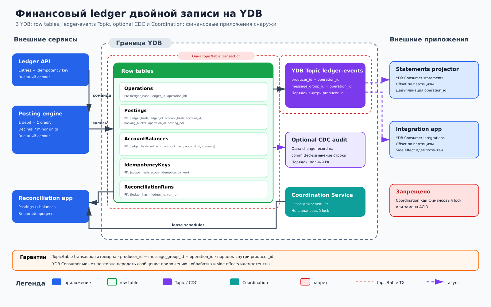

# Финансовый ledger двойной записи на YDB

## Назначение

Архитектура хранит финансовые операции как неизменяемый набор проводок двойной записи. Для каждой операции сумма дебетов равна сумме кредитов, проводки добавляются только append-only, а текущие остатки счетов изменяются в той же ACID-транзакции.

## Когда применять

- Для денежных и учетных контуров, где необходимы трассируемость, дедупликация команд и строгие инварианты.
- Когда остаток нужен в операционном пути без асинхронного пересчета.
- Когда интеграционные события должны появляться только для подтвержденных операций.

## Компоненты

- **Ledger API / posting engine** аутентифицирует команду, нормализует валюту и точность, проверяет равенство дебетов и кредитов.
- Строковые таблицы YDB: `Operations(ledger_hash, operation_id, ...)`, `Postings(ledger_hash, account_hash, booking_bucket, operation_id, posting_no, ...)`, `AccountBalances(ledger_hash, account_hash, account_id, currency, ...)`, `IdempotencyKeys(scope_hash, idempotency_key, ...)`, `ReconciliationRuns(ledger_hash, run_id, ...)`.
- **YDB Topic `ledger-events`** получает доменное событие в той же topic/table transaction, что и строки ledger; key сообщения — `operation_id`. YDB Topics — журнал pub/sub с независимыми consumer groups.
- Опциональные **CDC changefeeds** таблиц ledger служат для аудита изменений: CDC exactly-once записывает change record во внутренний changefeed topic и сохраняет порядок для одного полного первичного ключа исходной таблицы.
- **Reconciliation service** повторно суммирует проводки по счетам и сравнивает их с `AccountBalances`, фиксируя границы и результат прогона.
- Downstream consumers формируют выписки и вызывают внешние интеграции; они не являются источником баланса.

## Основной поток

1. Клиент отправляет сбалансированный набор entries и `idempotency_key`.
2. Posting engine проверяет валюту, допустимость счетов и условие `Σ debit = Σ credit` для каждой валюты.
3. Сервис читает `IdempotencyKeys` и затронутые `AccountBalances`; повтор возвращает сохраненный `operation_id`.
4. В одной topic/table transaction создается `Operations`, append-only строки `Postings`, обновляются все затронутые `AccountBalances`, сохраняется результат в `IdempotencyKeys` и записывается сообщение в `ledger-events` с key=`operation_id`.
5. После commit таблицы и доменное событие становятся видимыми вместе; при rollback не появляется ни одно из них. Опциональный CDC отдельно формирует аудит изменений таблиц.
6. Consumer groups строят выписки и выполняют интеграционные действия по `operation_id`; после сбоя чтение и обработка сообщения могут повториться, поэтому оба consumer идемпотентны.
7. Reconciliation service читает зафиксированный диапазон проводок, сравнивает вычисленные и сохраненные остатки и записывает результат в `ReconciliationRuns`.

## Согласованность и надежность

Финансовая граница атомарности охватывает операцию, все ее проводки, остатки и ключ идемпотентности. Конфликт обновления счета приводит к повтору всей транзакции с повторным чтением остатков. Денежные значения хранятся целыми минимальными единицами или фиксированным Decimal; `float` недопустим.

Проводки после commit не изменяются и не удаляются: исправление выполняется новой сторнирующей операцией со ссылкой на исходную. Topic/table transaction атомарно фиксирует строки и доменное событие. После сбоя consumer может повторно прочитать и обработать сообщение `ledger-events`, поэтому он дедуплицирует по `operation_id`; любой внешний side effect также требует идемпотентности. Для опционального аудита CDC exactly-once записывает change record во внутренний changefeed topic, но consumer этого topic тоже обязан выдерживать повторную обработку.

Coordination Service не заменяет ACID и не должен использоваться как финансовая блокировка счета или всего ledger. Корректность обеспечивают транзакционные проверки, версии строк и уникальные ключи, а не lease.

## Масштабирование и ключи партиционирования

`ledger_hash` отделяет независимые книги. `Operations` распределяется по хэшу `operation_id`. `Postings` использует `(ledger_hash, account_hash, booking_bucket, operation_id, posting_no)`: `account_hash` распределяет нагрузку, а ограниченный `booking_bucket` поддерживает чтение выписки без монотонного горячего хвоста. `AccountBalances` имеет ключ `(ledger_hash, account_hash, account_id, currency)`. `IdempotencyKeys` начинается со `scope_hash`. Для прикладного `ledger-events` явно задается topic key=`operation_id`; порядок между разными операциями не предполагается. Опциональный CDC-аудит нельзя произвольно партиционировать по `operation_id`: его внутренний changefeed topic следует полному PK каждой исходной таблицы.

Одна операция может затронуть несколько партиций, поэтому число счетов в ней ограничивают разумным пределом. Особенно горячий счет нельзя «исправить» локом Coordination Service: применяют бизнес-декомпозицию, лимиты входного потока или отдельные расчетные счета с последующим переносом.

## Отказы и восстановление

При таймауте commit клиент повторяет команду с тем же ключом и получает исходный результат. Если транзакция не состоялась, ни проводки, ни событие подтвержденной операции не появляются. Consumer после сбоя продолжает с подтвержденного offset и может повторно обработать сообщение; идемпотентность по `operation_id` делает retry безопасным. Сверка запускается по стабильной верхней границе, хранит прогресс в `ReconciliationRuns` и при расхождении блокирует автоматическое исправление: расследование завершается новой корректирующей операцией.

## Ограничения и антипаттерны

- Нельзя записывать дебет и кредит отдельными транзакциями или обновлять баланс асинхронно после проводок.
- Нельзя изменять и удалять `Postings`; исправления только append-only сторно.
- Нельзя использовать `float`, неявное округление или смешивать валюты без раздельной проверки инварианта.
- Нельзя публиковать финансовое событие до commit или полагаться на глобальный порядок топика.
- Нельзя использовать Coordination Service как финансовый lock.
- Архитектура использует только строковые таблицы и не является контуром аналитической отчетности.
