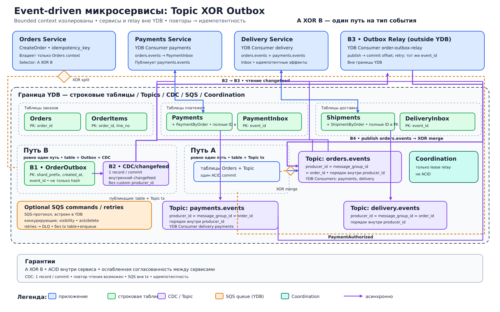

# Event-driven микросервисы: транзакционная публикация и Outbox

## Назначение
Архитектура связывает ограниченные контексты «Заказы», «Платежи» и «Доставка» событиями, не открывая сервисам прямой доступ к чужим таблицам. Каждый сервис владеет своими строковыми таблицами YDB и публикует факты через YDB Topics — журнал pub/sub с именованными YDB Consumers. Для опциональных команд и повторов доступна встроенная в YDB реализация SQS-совместимого протокола; модель независима от варианта развёртывания и использует конкурирующих потребителей (competing consumers), visibility timeout, ack/delete, повторы и DLQ.

## Когда применять
- Бизнес-операция затрагивает несколько автономных сервисов, а распределенная транзакция нежелательна.
- Нужна надежная публикация события вместе с изменением состояния.
- Допустима согласованность в конечном счёте между ограниченными контекстами и нужны повторная доставка и независимо масштабируемые подписчики.
- Требуется выбирать между прямой транзакционной публикацией и классическим Outbox без изменения бизнес-контракта события.

## Компоненты
- **Orders Service**: строковые таблицы `Orders` (`order_id`) и `OrderItems` (`order_id`, `line_no`).
- **Payments Service**: строковые таблицы `Payments` (`payment_id`) и `PaymentByOrder` (`order_id`).
- **Delivery Service**: строковые таблицы `Shipments` (`shipment_id`) и `ShipmentByOrder` (`order_id`).
- **YDB Topics**: `orders.events`, `payments.events`, `delivery.events`; это партиционированный журнал pub/sub, а не очередь конкурирующих потребителей. Для пользовательской записи задается `producer_id = message_group_id = order_id`; порядок сохраняется внутри `producer_id`.
- **Классический Outbox**: строковая таблица `OrderOutbox` (`shard_prefix`, `created_at`, `event_id`), CDC / поток изменений (changefeed) и отдельный ретранслятор Outbox вне границы YDB. `shard_prefix = hash(event_id) % N` только распределяет нагрузку, а исходный `event_id` обязательно остается в полном PK: идентичность только по хешу запрещена. CDC создает ровно одну запись об изменении для каждого зафиксированного изменения строки; чтение и обработка ретранслятором могут повториться.
- **Inbox/Deduplication** каждого consumer: строковые таблицы `PaymentInbox` и `DeliveryInbox` с ключом `event_id`.
- **Протокол SQS / очереди внутри YDB**: опциональные `payment.commands`, `delivery.retry`, `delivery.dlq`. Это конкурирующие потребители с visibility timeout и ack/delete, а не воспроизводимый Topic.
- **YDB Consumers**: именованные `YDB Consumer payments` и `YDB Consumer delivery`; смещение (offset) каждого consumer хранится отдельно по партициям Topic.
- **Coordination**: опциональные аренда (lease) и выбор лидера для ретранслятора/обработчиков; Coordination не заменяет ACID-транзакции.

## Основной поток
1. Клиент отправляет команду в Orders Service; сервис изменяет `Orders` и `OrderItems`.
2. Селектор выбирает ровно один путь для типа события: **A XOR B**. Вариант A — одна транзакция `table + Topic`, изменяющая `Orders`/`OrderItems` и публикующая `OrderCreated` в `orders.events`.
3. Вариант B — одна транзакция `table + Outbox`; CDC создает ровно одну запись об изменении зафиксированного изменения строки во внутреннем потоке изменений без пользовательских `producer_id`/`message_group_id`. Внешний ретранслятор Outbox читает ее, публикует событие в `orders.events` и затем фиксирует смещение. Повтор между публикацией и фиксацией смещения сохраняет тот же `event_id`. A и B никогда не применяются одновременно к одному типу события.
4. `YDB Consumer payments` и `YDB Consumer delivery` независимо читают `orders.events`. Каждый consumer атомарно фиксирует `event_id` в своей Inbox/Deduplication и обновляет только собственные таблицы.
5. Payments Service публикует `PaymentAuthorized` в `payments.events` с `producer_id = message_group_id = order_id`; Delivery Service читает его через именованный `YDB Consumer delivery-payments`.
6. Опциональный путь команд и повторов может использовать очереди SQS: сообщение временно скрывается visibility timeout, успешный обработчик выполняет ack/delete, а исчерпавшие повторы сообщения переходят в DLQ. Этот путь не участвует в A XOR B и не подразумевает атомарность строковой таблицы и постановки в очередь SQS; при необходимости надежной постановки используется Outbox/CDC/ретранслятор.
7. Внешние эффекты — списание у провайдера, письмо, вызов перевозчика — выполняются идемпотентно по `event_id` или отдельному `idempotency_key`.

## Согласованность и надежность
На схеме A XOR B — ровно один путь публикации на тип события; длинные детали SQS и идемпотентности вынесены в этот README.
Внутри сервиса состояние и выбранный путь публикации согласованы ACID. Между сервисами действует согласованность в конечном счёте и обработка подписчиком как минимум один раз, поэтому Inbox/Deduplication обязательна. CDC создает ровно одну запись об изменении на зафиксированное изменение строки; дубликат доменного события возможен при повторной обработке ретранслятором или подписчиком. Пользовательский Topic сохраняет порядок внутри `producer_id`, а смещение именованного YDB Consumer хранится по партициям и не подтверждает внешний эффект. Coordination помогает владеть арендой, но не обеспечивает атомарность данных и сообщения.

## Масштабирование и ключи партиционирования
Для пользовательских Topics применяется `producer_id = message_group_id = order_id`, поэтому события заказа упорядочены внутри этого producer. `payment_id` и `shipment_id` распределяют основные таблицы. У монотонного времени `OrderOutbox` использует `shard_prefix` перед временем, но полный PK также содержит исходный `event_id`. Именованный YDB Consumer масштабируется числом партиций Topic, а очереди SQS — числом конкурирующих обработчиков.

## Отказы и восстановление
- После неопределенного результата фиксации команда повторяется с тем же `idempotency_key`; сервис читает сохраненный результат.
- Упавший именованный YDB Consumer продолжает со смещения своей партиции, а Inbox отсекает повтор.
- Ретранслятор Outbox продолжает с подтвержденного смещения Topic потока изменений; если публикация завершилась до сбоя, повторная обработка может снова опубликовать событие с тем же `event_id`.
- Временные ошибки команд обрабатываются повторами с экспоненциальной задержкой, постоянные — DLQ с ручным разбором и контролируемой повторной отправкой (redrive).
- Если внешний вызов завершился, а подтверждение потеряно, повтор безопасен только при поддержке идемпотентного ключа внешней системой.

## Ограничения и антипаттерны
- Нельзя читать или изменять таблицы другого ограниченного контекста: интеграция идет через контракт API/события.
- Нельзя выполнять «сначала запись, потом публикация» двумя несвязанными операциями: сбой потеряет событие.
- Нельзя считать гарантию в пределах области действия CDC заменой идемпотентной бизнес-обработки подписчиком и внешних эффектов.
- Нельзя использовать один глобальный ключ партиционирования или один ретранслятор для всего потока.
- Нельзя смешивать Topic и SQS: Topic — журнал pub/sub с именованным YDB Consumer, SQS — конкурирующие потребители с visibility timeout и ack/delete.
- Нельзя считать запись в строковую таблицу и постановку в очередь SQS одной транзакцией; надежное связывание требует Outbox/CDC/ретранслятор.
- Нельзя использовать Coordination как распределенную ACID-транзакцию.
