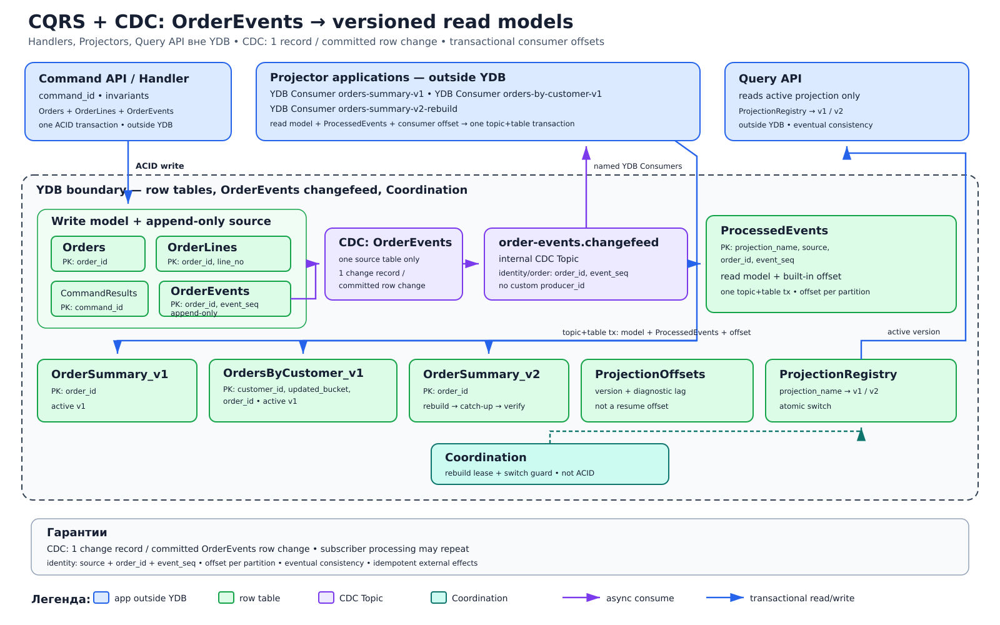

# CQRS с CDC и версионируемыми проекциями

## Назначение
CQRS разделяет модель записи и модели чтения. Внешний по отношению к границе YDB Command Handler атомарно изменяет нормализованную write model и добавляет доменные записи в append-only таблицу `OrderEvents`; CDC этой единственной таблицы создает ровно одну change record на committed row change в `order-events.changefeed`. Внешние Projector-приложения строят денормализованные строковые read models для внешнего Query API. YDB Topics здесь — replayable pub/sub log с именованными YDB Consumers, а не очередь competing consumers.

## Когда применять
- Профиль записи и набор запросов существенно различаются.
- Для чтения нужны несколько представлений с независимым масштабированием и жизненным циклом.
- Допустима явно измеряемая eventual consistency между подтверждением команды и появлением данных в Query API.
- Нужны безопасный rebuild и переключение версии проекции без остановки записи.

## Компоненты
- **Command API / handler**: принимает `command_id`, проверяет бизнес-инварианты и выполняет ACID-транзакцию.
- **Write model**: нормализованные строковые таблицы `Orders` (`order_id`), `OrderLines` (`order_id`, `line_no`) и результаты идемпотентных команд `CommandResults` (`command_id`).
- **Источник CDC**: append-only строковая таблица `OrderEvents` с полным первичным ключом (`order_id`, `event_seq`). Этот PK задает identity записи и порядок событий одного заказа; `customer_id` для `OrdersByCustomer_v1` хранится в payload события.
- **CDC/changefeed**: `order-events.changefeed` принадлежит только `OrderEvents` и создает ровно одну change record на committed row change. Это внутренний CDC Topic: ему нельзя назначать произвольные `producer_id`/`message_group_id`. Чтение и обработка subscriber могут повториться.
- **Projectors вне YDB**: приложения используют именованные `YDB Consumer orders-summary-v1`, `YDB Consumer orders-by-customer-v1` и временный `YDB Consumer orders-summary-v2-rebuild`.
- **Read models**: строковые таблицы `OrderSummary_v1` (`order_id`), `OrdersByCustomer_v1` (`customer_id`, `updated_bucket`, `order_id`) и новая `OrderSummary_v2`.
- **Прогресс и дедупликация**: встроенный consumer offset YDB Topic коммитится транзакционно вместе с read model. `ProjectionOffsets` (`projection_name`, `partition_id`) хранит версию projector и диагностический lag, но не служит вторым resume-offset; `ProcessedEvents` имеет ключ (`projection_name`, `source`, `order_id`, `event_seq`), где `source = OrderEvents`.
- **Query API вне YDB**: читает только активную версию read model; указатель хранится в `ProjectionRegistry` (`projection_name`).
- **Coordination**: lease rebuild-воркера и сериализация переключения версии; Coordination не заменяет ACID.

## Основной поток
1. Клиент отправляет команду с `command_id` в Command API.
2. Handler читает нужную версию write model, проверяет инварианты и в одной YDB ACID-транзакции изменяет `Orders`/`OrderLines`, добавляет одну или несколько строк в `OrderEvents` с последовательными `event_seq` и сохраняет результат в `CommandResults`; повтор `command_id` возвращает тот же результат.
3. CDC, привязанный только к `OrderEvents`, создает ровно одну change record на committed row change в `order-events.changefeed`. Identity события — (`source = OrderEvents`, `order_id`, `event_seq`); дополнительный случайный идентификатор не вводится.
4. Каждый внешний projector читает `order-events.changefeed` через свой именованный YDB Consumer. В одной YDB topic+table транзакции он изменяет строковую read model и `ProcessedEvents`, затем транзакционно коммитит встроенный consumer offset соответствующих партиций. При rollback не фиксируются ни модель, ни offset; повтор чтения безопасен.
5. Query API читает активную таблицу, указанную в `ProjectionRegistry`; сразу после шага 2 старая версия ответа еще допустима — это eventual consistency.
6. Для rebuild создаются новая строковая read model `OrderSummary_v2` и отдельный `YDB Consumer orders-summary-v2-rebuild`. Согласованный baseline append-only таблицы `OrderEvents` привязывается к позиции `order-events.changefeed`, после чего этот consumer догоняет live-поток до контрольного встроенного consumer offset.
7. После проверки полноты и lag `ProjectionRegistry` атомарно переключает Query API с `OrderSummary_v1` на `OrderSummary_v2`; v1 сохраняется для быстрого rollback и удаляется позже по регламенту.
8. Любые внешние эффекты projector выполняет идемпотентно по (`source`, `order_id`, `event_seq`); предпочтительно отделять их от построения проекции.

## Согласованность и надежность
Write model и append в `OrderEvents` согласованы одной ACID-транзакцией, read models — eventual consistency. CDC создает ровно одну change record на committed row change; именованный YDB Consumer может повторно прочитать или начать обработку записи после сбоя. Topic+table транзакция атомарно фиксирует изменение read model и встроенный offset по партициям, а identity (`source`, `order_id`, `event_seq`) защищает replay. Внешние эффекты идемпотентны по этой identity. Coordination управляет владением работой, но не обеспечивает атомарность таблиц.

## Масштабирование и ключи партиционирования
В `OrderEvents` полный PK (`order_id`, `event_seq`) задает identity и последовательность событий заказа; внутренний changefeed наследует источник и не получает пользовательские writer IDs. Один чрезмерно горячий `order_id` требует пересмотра границы агрегата. `OrdersByCustomer_v1` распределяет крупных клиентов дополнительным `updated_bucket`; если bucket вычисляется hash-функцией, полный PK обязательно сохраняет исходные `customer_id` и `order_id`, а не hash-only identity. Встроенный consumer offset ведется отдельно по партициям именованного YDB Consumer; `ProjectionOffsets` не участвует в resume-протоколе.

## Отказы и восстановление
- При падении projector продолжает со встроенного offset по партициям своего именованного YDB Consumer. Незакоммиченный batch читается снова; topic+table транзакция не оставляет частично обновленную read model.
- Poison event с identity (`OrderEvents`, `order_id`, `event_seq`) переводит конкретную проекцию в состояние `blocked`, сохраняется с диагностикой и исправляется контролируемым replay; тихо пропускать событие нельзя.
- При длительном простое выполняется rebuild новой версии из `OrderEvents` и `order-events.changefeed`, а не изменение активной таблицы на месте.
- Если v2 не догнала контрольный offset или не прошла сверку, переключение не выполняется; активной остается v1.
- Неопределенный результат команды повторяется с тем же `command_id`; внешние вызовы — только с идемпотентным ключом.

## Ограничения и антипаттерны
- Нельзя писать через Query API или изменять read model вручную как источник истины.
- Нельзя коммитить встроенный consumer offset отдельно от транзакционного обновления проекции; `ProjectionOffsets` нельзя использовать как конкурирующий resume-механизм.
- Нельзя обещать мгновенную согласованность после команды без отдельного протокола read-your-writes.
- Нельзя перестраивать активную таблицу in-place: используйте новую версию и атомарное переключение.
- Нельзя объединять изменения разных исходных таблиц в один changefeed или назначать внутреннему CDC Topic пользовательские `producer_id`/`message_group_id`: `order-events.changefeed` принадлежит только `OrderEvents`.
- Нельзя вводить дополнительный случайный идентификатор вместо естественной identity (`source`, `order_id`, `event_seq`).
- Нельзя считать Coordination заменой ACID, Topic — очередью competing consumers, а retention topic — бессрочным архивом данных.
