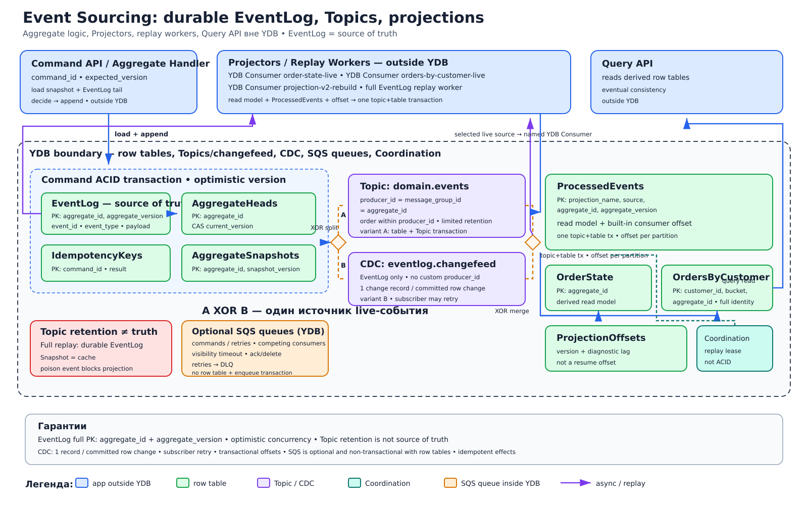

# Event Sourcing на строковых таблицах YDB

## Назначение
Состояние агрегата восстанавливается из неизменяемой последовательности доменных событий в долговечной строковой таблице `EventLog`. Это источник истины; YDB Topic используется как pub/sub log для оперативной доставки событий projectors, но его ограниченный retention не должен быть единственным долговечным источником. Текущее состояние для запросов хранится в производных строковых read models.

## Когда применять
- История изменений имеет самостоятельную бизнес-ценность и нужна детерминированная реконструкция состояния.
- Правила удобно выражаются через aggregate и optimistic concurrency.
- Нужны независимые проекции, аудит и возможность построить новую модель чтения replay событий.
- Команда может принять дополнительную сложность схем событий, миграций, replay и eventual consistency.

## Компоненты
- **Command API / Aggregate handler**: принимает `command_id`, загружает aggregate и ожидаемую версию, проверяет инварианты.
- **`EventLog`**: долговечная строковая таблица с ключом (`aggregate_id`, `aggregate_version`), содержащая `event_id`, `event_type`, payload и время.
- **`AggregateHeads`**: строковая таблица (`aggregate_id`) с текущей версией для optimistic compare-and-set.
- **`AggregateSnapshots`**: необязательная строковая таблица (`aggregate_id`, `snapshot_version`) для ускорения загрузки; это кэш, не источник истины.
- **`IdempotencyKeys`**: строковая таблица (`command_id`) с результатом команды и диапазоном созданных событий.
- **Topic `domain.events`**: YDB Topics = partitioned pub/sub log, ключ партиционирования `aggregate_id`; публикуется атомарно с `EventLog` либо наполняется CDC, который ровно один раз создает change record для committed-строки.
- **Projectors**: читают topic либо replay `EventLog` и строят строковые таблицы `OrderState` (`aggregate_id`) и `OrdersByCustomer` (`customer_id`, `bucket`, `aggregate_id`).
- **Offsets и дедупликация**: встроенный consumer offset YDB Topic коммитится в topic+table транзакции вместе с read model. `ProjectionOffsets` хранит версию projector и диагностический lag, но не является вторым resume-offset; `ProcessedEvents` дедуплицирует replay и внешние эффекты по (`projection_name`, `event_id`).
- **Coordination**: lease projector/replay worker; Coordination не заменяет ACID.

## Основной поток
1. Command API получает команду с `command_id`, `aggregate_id` и `expected_version`.
2. Handler проверяет `IdempotencyKeys`; при первом вызове читает snapshot и хвост `EventLog`, затем восстанавливает aggregate и проверяет инварианты.
3. В одной YDB ACID-транзакции handler условно обновляет `AggregateHeads` с `expected_version`, добавляет события в `EventLog`, сохраняет результат в `IdempotencyKeys` и публикует события в `domain.events`.
4. Если транзакционная публикация table+topic недоступна для выбранного режима, транзакция пишет `EventLog`, а CDC/changefeed ровно один раз создает в topic change record для каждой committed-строки; два варианта не применяются одновременно к одному событию. Subscriber все равно может повторно прочитать или начать обработку записи после сбоя.
5. Конкурирующая команда с устаревшей версией получает conflict, перечитывает aggregate и повторно принимает бизнес-решение, а не слепо повторяет запись.
6. Projectors читают события в порядке `aggregate_id`. В одной YDB topic+table транзакции projector обновляет read model и `ProcessedEvents`, затем транзакционно коммитит встроенный consumer offset; при rollback не фиксируется ни модель, ни offset.
7. Query API читает только read models; между commit события и обновлением проекции действует явная eventual consistency.
8. Snapshot создается после заданного числа событий и проверяется по `snapshot_version`; aggregate всегда может быть восстановлен из `EventLog` без snapshot.
9. Внешние эффекты выполняются идемпотентно по `event_id`/`command_id`, поскольку доставка и replay допускают повторы.

## Согласованность и надежность
Добавление событий, смена aggregate version, запись idempotency result и предпочтительная публикация атомарны. При альтернативе CDC ровно один раз записывает change record committed-события в topic. Порядок гарантируется для одного `aggregate_id`, но глобального порядка между агрегатами нет. Subscriber может повторно получить batch; topic+table транзакция атомарно фиксирует read model и встроенный consumer offset, а `ProcessedEvents` и идемпотентность защищают replay и внешние эффекты. Topic ускоряет fan-out и replay в пределах retention, однако только `EventLog` задает полную долговечную историю. Coordination распределяет работу и lease, но не добавляет транзакционность.

YMQ/SQS-подобная очередь может применяться для команд или ограниченных повторов как отдельный сервис поверх YDB с competing consumers; это не встроенный объект YDB и не замена `EventLog` или YDB Topic.

## Масштабирование и ключи партиционирования
`aggregate_id` одновременно локализует историю агрегата и задает partition key topic, сохраняя порядок. Aggregate с экстремальной частотой команд остается hot key и требует изменения границ агрегата, а не случайного распределения его событий. Вторичный read model использует `bucket` для крупных клиентов. Встроенный consumer offset ведется по partition consumer group; диагностический `ProjectionOffsets` разделен по `partition_id`, но не участвует в resume-протоколе. Projectors масштабируются до числа партиций topic.

## Отказы и восстановление
- Неопределенный результат commit проверяется повтором того же `command_id`; `IdempotencyKeys` возвращает исходный результат без новых событий.
- Version conflict не является инфраструктурным повтором: aggregate перечитывается, команда валидируется заново.
- Упавший projector продолжает со встроенного consumer offset своей topic consumer group. Незакоммиченный batch читается снова; topic+table транзакция не оставляет частично обновленную read model.
- Утерянная или испорченная проекция строится заново в новой таблице отдельным replay worker/consumer group из полного `EventLog`, затем догоняет topic и атомарно переключается.
- Невалидный snapshot отбрасывается; восстановление продолжается из событий.
- Poison event останавливает затронутую проекцию до исправления обработчика/upcaster; событие нельзя тихо пропускать.

## Ограничения и антипаттерны
- Нельзя использовать topic retention как единственное долговечное хранилище событий.
- Нельзя изменять или удалять опубликованные строки `EventLog`; исправление оформляется компенсирующим событием.
- Нельзя менять смысл старого `event_type` без версий схемы и детерминированных upcaster.
- Нельзя считать snapshot источником истины или строить его в той же горячей транзакции после каждой команды.
- Нельзя сохранять в событии недетерминированные ссылки на текущее внешнее состояние.
- Нельзя обещать глобальный порядок, exactly-once внешних эффектов или мгновенную согласованность read model.
- Нельзя коммитить consumer offset отдельно от read model или использовать `ProjectionOffsets` как конкурирующий resume-механизм.
- Нельзя использовать Coordination вместо ACID или давать Query API прямую запись в проекцию.
