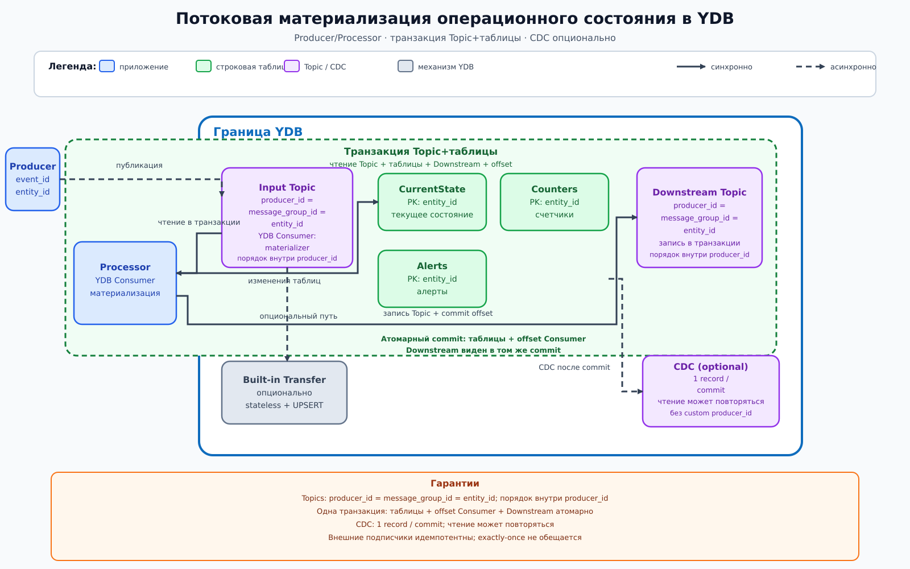

# Потоковая материализация операционного состояния в YDB

## Назначение

Архитектура поддерживает актуальное операционное состояние сущностей по потоку событий: последнее состояние, счетчики и активные предупреждения. Материализации рассчитаны на точечные и короткие диапазонные запросы к строковым таблицам YDB.

## Когда применять

- события приходят непрерывно, а приложению нужен быстро читаемый актуальный срез;
- порядок важен внутри одной сущности, но не требуется глобальный порядок;
- результат обработки события можно атомарно зафиксировать вместе с прогрессом именованного YDB Consumer;
- допустима доставка «как минимум один раз» за пределами локальной транзакции при наличии идемпотентности.

Для простой stateless-трансформации с последующим UPSERT допустим опциональный Transfer. Оконные вычисления, сложные переходы состояния, несколько взаимозависимых записей и бизнес-валидация должны выполняться приложением-процессором.

## Компоненты

| Компонент | Роль |
|---|---|
| Producers | Внешние приложения публикуют события с `producer_id = message_group_id = entity_id` |
| Input Topic | YDB Topic: долговечный pub/sub log с партициями, offset и именованными YDB Consumers |
| Processor group | Внешние приложения читают через именованный YDB Consumer, используют встроенную транзакцию Topic и материализуют состояние |
| CurrentState | Строковая таблица актуального состояния, ключ `entity_id` |
| Counters | Строковая таблица операционных счетчиков; ключ включает `entity_id` и тип счетчика |
| Alerts | Строковая таблица активных предупреждений; ключ начинается с `entity_id` |
| Downstream Topic | YDB Topics pub/sub log; производное событие записывается в той же транзакции, что и материализация |
| CDC changefeed | Опциональный дополнительный поток изменений строковых таблиц, не основной механизм надежной публикации |
| Transfer (опционально) | Только stateless-преобразование и UPSERT без сложной бизнес-логики |

Встроенный SQS-совместимый протокол, доступный во всех поддерживаемых развертываниях YDB, здесь не требуется. Это часть YDB для competing consumers, visibility timeout, ack/delete, retry и DLQ, тогда как эта схема использует Topics как pub/sub log с именованными YDB Consumers.

Внутри границы YDB находятся только Input/Downstream Topics, row tables, CDC changefeed и опциональный встроенный Transfer. Producers и processor group работают снаружи; транзакция процессора пересекает границу через API YDB.

## Основной поток

1. Producer публикует событие в Input Topic с `producer_id = message_group_id = entity_id`.
2. Topic сохраняет порядок сообщений внутри одного `producer_id`; глобальный порядок между разными `producer_id` не гарантируется.
3. Экземпляр processor group через именованный YDB Consumer начинает встроенную транзакцию чтения YDB Topic и получает очередное событие вместе с позицией Consumer.
4. В этой же ACID-транзакции YDB процессор изменяет `CurrentState`, `Counters` и/или `Alerts`, записывает производное событие в Downstream Topic и выполняет transactional commit consumer offset средствами Topic API. Конкурирующая прикладная таблица offset не используется.
5. После commit изменения row tables, новая позиция именованного YDB Consumer в Input Topic и сообщение Downstream Topic становятся видимы атомарно. Для Downstream Topic используется `producer_id = message_group_id = entity_id`; частично зафиксированного результата нет.
6. Внешние подписчики асинхронно читают Downstream Topic. Их обработка может повториться, поэтому производное событие имеет стабильный `event_id`, а subscriber остается идемпотентным.
7. CDC можно дополнительно включить для изменений row tables. CDC создает одну change record на каждое committed row change, но чтение и обработка record подписчиком могут повториться; CDC не является основным путем надежности downstream-публикации.

## Согласованность и надежность

Изменение материализаций, запись в Downstream Topic и встроенный transactional commit consumer offset атомарны, потому что выполняются в одной транзакции YDB. При повторе до commit транзакция снова читает событие; после успешного commit одновременно видны row tables, продвинутый input offset и производное событие. Доставка сообщения внешнему subscriber остается асинхронной и допускает повторную обработку.

CDC — альтернативный дополнительный поток изменений таблиц: одна change record создается на каждое committed row change. Это не означает exactly-once processing — чтение и обработка подписчиком могут повторяться. Надежность основного производного события обеспечивается его транзакционной записью в Downstream Topic.

Публикация во внешний сервис не входит в ACID-транзакцию YDB. Такой side effect обязан быть идемпотентным, например по `event_id`. Coordination не заменяет ACID и не делает совокупность записи, публикации и внешнего вызова единой транзакцией.

## Масштабирование и ключи партиционирования

Для обоих пользовательских Topics задается `producer_id = message_group_id = entity_id`; порядок сохраняется внутри `producer_id`. Число одновременно читаемых партиций именованным YDB Consumer ограничивает параллелизм процессоров. Базовый PK row tables содержит исходный `entity_id`. Если нужен hash-sharding, хеш используется только как shard prefix: `(hash(entity_id) % N, entity_id, ...)`; исходный ID обязательно остается в PK. Монотонное время не следует ставить единственным первым компонентом ключа. Для «горячих» сущностей нужна осознанная декомпозиция, поскольку произвольное шардирование одной сущности разрушает ее порядок.

## Отказы и восстановление

До commit событие может быть прочитано повторно, но изменения row tables, downstream-сообщение и Consumer offset откатятся вместе. Если запись в Downstream Topic недоступна, вся транзакция завершается ошибкой и повторяется без частичного состояния. После commit именованный YDB Consumer возобновляет Input Topic со следующего offset, а downstream subscriber может получить сообщение повторно и дедуплицирует его по `event_id`. CDC создает одну change record на committed row change, однако ее чтение и subscriber processing могут повториться после сбоя. Lag именованных YDB Consumers и CDC контролируется; исчерпание retention требует восстановления из резервного источника.

## Ограничения и антипаттерны

- Использовать материализацию как аналитическое хранилище или выполнять широкие сканы.
- Считать порядок глобальным, хотя пользовательский Topic гарантирует его только внутри `producer_id`.
- Менять таблицы и фиксировать offset раздельно либо дублировать встроенный offset конкурирующей прикладной таблицей.
- Публиковать основное производное событие после commit отдельным асинхронным вызовом или считать CDC заменой транзакционной записи в Downstream Topic.
- Выполнять сложную stateful-логику в Transfer.
- Вызывать внешний API внутри повторяемого обработчика без idempotency key.
- Считать Coordination заменой транзакции или путать Topics со встроенной SQS queue.
