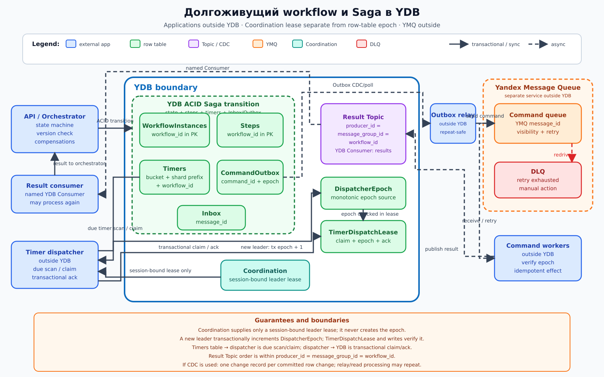

# Долгоживущий workflow и Saga в YDB

## Назначение

Архитектура реализует оркестрируемую Saga: конечный автомат хранит состояние долгоживущего workflow, выдает идемпотентные команды, принимает результаты, запускает таймеры и выполняет компенсации. YDB хранит только строковые таблицы операционного состояния.

## Когда применять

- бизнес-процесс состоит из нескольких локальных транзакций и внешних побочных эффектов;
- процесс живет дольше одного запроса и должен восстанавливаться после перезапуска;
- нужны таймеры, повторы, компенсации и ручное разрешение неоднозначного результата;
- шаги допускают идемпотентное исполнение или проверку ранее полученного результата.

Saga не создает распределенную ACID-транзакцию: промежуточные состояния видимы, а компенсация является отдельным бизнес-действием и тоже может завершиться ошибкой.

## Компоненты

| Компонент | Роль |
|---|---|
| API / оркестратор | Внешнее приложение конечного автомата, проверяющее версию workflow и выбирающее следующий шаг |
| WorkflowInstances | Строковая таблица состояния, версии и результата экземпляра; ключ `workflow_id` |
| Steps | Строковая таблица попыток и результатов шагов; ключ начинается с `workflow_id` |
| Timers | Строковая таблица дедлайнов; ключ распределяет bucket времени и включает `workflow_id` |
| CommandOutbox | Строковая таблица команд, атомарно записанных с переходом состояния |
| Inbox | Строковая таблица дедупликации результатов и входных сообщений |
| DispatcherEpoch / TimerDispatchLease | Строковая таблица монотонной эпохи (epoch) и аренды таймеров; именно она является источником fencing-эпохи |
| Диспетчер таймеров | Внешнее приложение: сканирует/захватывает наступившие таймеры и транзакционно записывает подтверждение/переход |
| Coordination | Только аренда лидера, привязанная к сессии (lease); Coordination не создает монотонный fencing-токен |
| Очередь SQS | Встроенная реализация SQS-совместимого протокола, доступная во всех поддерживаемых развертываниях YDB: конкурирующие потребители (competing consumers), visibility timeout, ack/delete и повторы |
| Обработчики | Внешние конкурирующие потребители выполняют обычные и компенсационные команды |
| Result Topic | YDB Topic результатов; издатель задает `producer_id = message_group_id = workflow_id` |
| Result consumer | Внешний именованный YDB Consumer передает результаты оркестратору |
| DLQ | Изолирует команды после исчерпания повторов для ручного разбора |

Встроенная очередь SQS предоставляет конкурирующих потребителей, visibility timeout, ack/delete, повторы и DLQ. YDB Topics — другая модель: долговечный журнал pub/sub с именованными YDB Consumers. Результаты публикуются в Topic, а не трактуются как сообщения той же очереди. Нахождение очереди SQS внутри границы YDB не включает постановку в очередь и подтверждение (ack) в ACID-транзакцию строковых таблиц.

Внутри границы YDB находятся строковые таблицы, Result Topic, поток изменений CDC при использовании, Coordination, очередь SQS и DLQ. API, оркестратор, ретранслятор Outbox, диспетчер таймеров, обработчики команд и result consumer — внешние приложения.

## Основной поток

1. API создает `WorkflowInstances` и начальный `Steps`, а в той же ACID-транзакции добавляет команду в `CommandOutbox`.
2. Внешний ретранслятор Outbox асинхронно переносит зафиксированную запись об изменении `CommandOutbox` во встроенную очередь SQS; повторная отправка безопасна благодаря стабильному `command_id`. Транзакция над строковыми таблицами и постановка в очередь SQS не атомарны.
3. Один из конкурирующих обработчиков получает команду, выполняет идемпотентный внешний побочный эффект и публикует результат в Result Topic с `producer_id = message_group_id = workflow_id`. После подтвержденной записи результата обработчик выполняет SQS ack/delete; сбой до ack приводит к повторной доставке.
4. Внешний result consumer читает Topic через именованный YDB Consumer и передает результат оркестратору. Тот дедуплицирует `message_id` в `Inbox` и в одной транзакции обновляет `Steps`, версию `WorkflowInstances`, необходимые `Timers` и следующую `CommandOutbox`.
5. При успехе автомат переходит к следующему шагу или завершает workflow.
6. При окончательной ошибке автомат в обратном порядке создает команды компенсации для уже выполненных шагов.
7. Новый лидер получает аренду, привязанную к сессии, в Coordination, затем в транзакции YDB увеличивает `DispatcherEpoch` и запоминает полученную эпоху. Coordination сама эпоху не выдает.
8. Внешний диспетчер таймеров сканирует диапазон наступивших `Timers`, транзакционно захватывает запись в `TimerDispatchLease` с текущей эпохой, а после диспетчеризации записывает подтверждение/переход обратно в YDB. Каждая команда таймера несет эпоху, а обработчик и транзакция записи сверяют ее с текущим `DispatcherEpoch`; устаревший лидер не может зафиксировать переход.
9. После исчерпания повторов команда отправляется в DLQ; оператор сверяет внешний результат и явно возобновляет, компенсирует либо завершает процесс вручную.

## Согласованность и надежность

Переход конечного автомата, версия экземпляра, шаг, таймер и запись Outbox фиксируются одной ACID-транзакцией YDB. Оптимистичная конкурентность по версии не позволяет двум результатам одновременно продвинуть Saga. Inbox делает повторную доставку результата безвредной.

Очередь SQS и Result Topic работают асинхронно и дают доставку как минимум один раз на прикладной границе. Visibility timeout не означает отмену уже начатого вызова. Каждый внешний побочный эффект и компенсация обязаны принимать ключ идемпотентности (`command_id`) либо уметь надежно обнаруживать ранее выполненную операцию.

Coordination не заменяет ACID и предоставляет только аренду, привязанную к сессии. Монотонная fencing-эпоха создается транзакционным увеличением `DispatcherEpoch` в строковой таблице YDB; `TimerDispatchLease`, обработчики и все записи переходов проверяют эту эпоху. Потеря сессии не мгновенно останавливает старый процесс, но сравнение эпохи не дает ему зафиксировать состояние. Если обработчик таймера делает внешний побочный эффект, внешняя система должна проверять эпоху либо операция должна быть идемпотентной.

Если ретранслятор для `CommandOutbox` использует CDC, CDC создает одну запись об изменении на каждое зафиксированное изменение строки. Чтение, доставка и обработка записи могут повторяться, поэтому `command_id` остается обязательным; обработка ровно один раз не обещается.

## Масштабирование и ключи партиционирования

`workflow_id` остается в PK таблиц `WorkflowInstances`, `Steps`, `CommandOutbox` и `Inbox`. Если требуется хеш-шардирование, хеш служит только префиксом шарда: `(hash(workflow_id) % N, workflow_id, ...)`; исходный `workflow_id` не заменяется хешем. Очередь SQS масштабирует обработчиков как конкурирующих потребителей. Для Result Topic используется `producer_id = message_group_id = workflow_id`, поэтому порядок результатов одного процесса сохраняется внутри `producer_id`; result consumer — именованный YDB Consumer.

Для `Timers` нельзя использовать голую монотонную временную метку первым ключом: применяются временной bucket и префикс шарда, например `(bucket, hash(workflow_id) % N, deadline, workflow_id)`. Хеш только распределяет шард, исходный `workflow_id` остается в PK. Несколько процессов-диспетчеров могут обслуживать разные buckets, а Coordination выдает только аренду лидера, привязанную к сессии, там, где требуется эксклюзивное назначение. `DispatcherEpoch` отдельно создает монотонную эпоху транзакцией над строковой таблицей и является редкой точкой записи при смене лидера.

## Отказы и восстановление

После фиксации, но до отправки издатель повторно прочитает `CommandOutbox`. Дубликат команды безопасен по `command_id`. Если обработчик завершил побочный эффект и упал до результата, команда появится после visibility timeout; повтор обязан вернуть прежний результат. Просроченная сессия Coordination приводит к перевыборам; новый лидер транзакционно увеличивает `DispatcherEpoch`, и проверки эпохи отклоняют записи старого лидера.

Команды с постоянной ошибкой после экспоненциальной задержки попадают в DLQ. Неоднозначный внешний результат, провал компенсации или несовместимое изменение схемы процесса требуют ручного вмешательства; оператор не должен слепо повторять неидемпотентную операцию.

## Ограничения и антипаттерны

- Считать Saga эквивалентом распределенной ACID-транзакции.
- Хранить состояние автомата только в памяти оркестратора.
- Публиковать команду отдельно от перехода без Outbox.
- Считать visibility timeout гарантией доставки ровно один раз или отменой побочного эффекта.
- Выполнять внешний побочный эффект без ключа идемпотентности.
- Считать Coordination источником монотонного токена или полагаться на выбор лидера без `DispatcherEpoch` и проверки сессии.
- Считать компенсацию техническим откатом либо путать очередь SQS с Topics.
