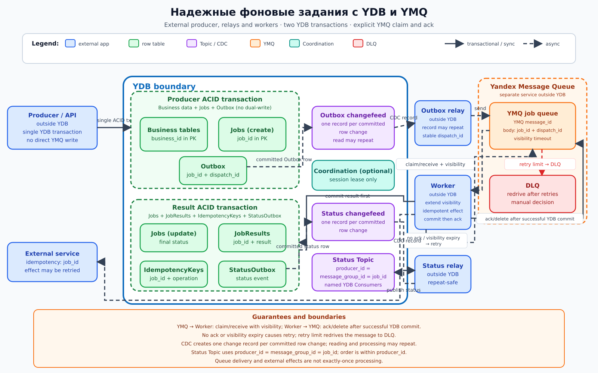

# Надежные фоновые задания с YDB и SQS

## Назначение

Архитектура отделяет прием бизнес-запроса от длительной фоновой работы. Producer атомарно изменяет бизнес-данные и создает задание с outbox-записью; dispatcher доставляет его во встроенную SQS queue YDB, а конкурирующие workers выполняют работу с retry, дедупликацией и контролируемым завершением.

## Когда применять

- обработка дольше допустимого времени синхронного ответа;
- нагрузку нужно сглаживать очередью и независимо масштабировать workers;
- требуются visibility timeout, retry/backoff, DLQ и ручный повтор;
- бизнес-транзакция должна надежно порождать задание без окна двойной записи.

Если нескольким независимым подписчикам нужен журнал событий, применяется YDB Topic. Если одно задание должен забрать один из competing consumers, применяется встроенная SQS queue.

## Компоненты

| Компонент | Роль |
|---|---|
| Producer / API | Внешнее приложение: в одной транзакции меняет бизнес-таблицы и регистрирует задание |
| Business tables | Строковые таблицы предметной области |
| Jobs | Строковая таблица статуса, попытки, lease и параметров; ключ `job_id` |
| Outbox | Строковая таблица ожидающей постановки задания; стабильный прикладной `dispatch_id` |
| Outbox relay / dispatcher | Внешнее приложение: получает change record Outbox и повторяемо отправляет сообщение в SQS queue |
| SQS queue | Встроенная реализация SQS-совместимого протокола, доступная во всех поддерживаемых развертываниях YDB, с competing consumers и visibility timeout |
| Workers | Внешние приложения: claim/receive, продление visibility, выполнение, commit результата и ack/delete |
| JobResults | Строковая таблица результата по `job_id` |
| IdempotencyKeys | Строковая таблица дедупликации попыток/операций |
| StatusOutbox | Строковая таблица статусных событий, атомарно записанных с результатом |
| Status events Topic | YDB Topic статусов; relay задает `producer_id = message_group_id = job_id` |
| DLQ | Сообщения после исчерпания политики retry |

SQS queue и YDB Topics не взаимозаменяемы. SQS дает competing consumers, visibility timeout, ack/delete, retry и DLQ. Topic — партиционированный pub/sub log с offset каждого именованного YDB Consumer. Для SQS не задаются Topic-поля `producer_id`/`message_group_id`: queue присваивает сообщению `message_id`, а прикладная дедупликация использует стабильный `dispatch_id`/`job_id`; `deduplication_id` задается только если выбранный тип очереди явно поддерживает эту возможность.

Внутри границы YDB находятся row tables, CDC changefeeds, Status events Topic, опциональная Coordination, SQS job queue и DLQ. Producer/API, outbox dispatcher/relay, status relay, workers и внешний side-effect service — внешние приложения. Общей транзакции row tables и SQS enqueue/ack нет.

## Основной поток

1. Producer в одной ACID-транзакции обновляет `Business tables`, создает запись `Jobs` и соответствующую запись `Outbox`. Прямой SQS enqueue отсутствует, поэтому dual-write нет.
2. CDC создает одну change record на committed row change записи `Outbox`. Внешний dispatcher/relay может прочитать и обработать record повторно, поэтому отправляет в SQS queue стабильные прикладные `job_id` и `dispatch_id`; queue возвращает собственный `message_id`.
3. SQS queue отдает сообщение одному из competing workers: worker выполняет claim/receive, а queue скрывает сообщение на visibility timeout.
4. Worker проверяет `IdempotencyKeys` и состояние `Jobs`. Для долгой операции он своевременно продлевает visibility, понимая, что lease не является блокировкой внешнего side effect.
5. Worker выполняет внешний side effect с `job_id` как idempotency key.
6. В одной ACID-транзакции worker обновляет `Jobs` и записывает `JobResults`, `IdempotencyKeys` и `StatusOutbox`.
7. Только после успешного commit worker отправляет в SQS queue ack/delete с актуальным receipt handle. До commit ack запрещен; потерянный ack приводит к безопасной повторной доставке.
8. CDC создает одну change record на committed row change `StatusOutbox`, после чего внешний status relay публикует статус в Status events Topic с `producer_id = message_group_id = job_id`. Чтение и обработка change record или Topic-сообщения могут повторяться.
9. При временной ошибке worker не подтверждает сообщение: visibility expiry возвращает его в SQS queue для retry/backoff. После лимита redrive отправляет сообщение в DLQ.

## Согласованность и надежность

Бизнес-изменение, `Jobs` и `Outbox` атомарны внутри первой транзакции YDB. Обновление `Jobs`, `JobResults`, `IdempotencyKeys` и `StatusOutbox` атомарно внутри транзакции результата. CDC создает одну change record на каждое committed row change; relay и конечные подписчики могут читать и обрабатывать record повторно. SQS enqueue, claim/receive, внешний side effect и ack/delete не образуют одну транзакцию с row tables, и exactly-once processing не обещается.

Одна очередь не обеспечивает exactly-once внешний эффект. Worker может успешно вызвать внешний сервис и потерять visibility или упасть до commit/delete; тогда другой worker получит то же сообщение. Внешняя операция обязана быть идемпотентной по стабильному ключу или поддерживать запрос ранее полученного результата. Для неидемпотентного API нужен прикладной протокол сверки и возможность ручного разрешения.

Coordination при дополнительном назначении лидера dispatcher не заменяет ACID и обычно не нужна для эксклюзивности обработки: эту роль выполняет SQS visibility. Если Coordination все же применяется, необходимы сессии и fencing.

## Масштабирование и ключи партиционирования

Исходный `job_id` остается в PK таблиц `Jobs`, `JobResults` и `IdempotencyKeys`. Если нужен hash-sharding, хеш используется только как shard prefix: `(hash(job_id) % N, job_id, ...)`. Для выборки outbox по состоянию используют bucket и shard prefix с исходным `job_id` в PK, а не один монотонный timestamp. Dispatcher обрабатывает shards параллельно.

Количество workers масштабируется по глубине очереди, возрасту старейшего сообщения и длительности обработки. Visibility timeout должен превышать типичный интервал между heartbeat-продлениями, но не быть настолько большим, чтобы затягивать восстановление. Для Status events Topic relay задает `producer_id = message_group_id = job_id`; порядок статусов одного задания сохраняется внутри `producer_id`. Подписчики используют именованные YDB Consumers.

## Отказы и восстановление

Если relay упал до отправки, чтение CDC record будет повторено; если после отправки, возможен дубликат SQS-сообщения. CDC создает одну change record на committed row change, но не гарантирует однократную обработку. Если worker упал до side effect, сообщение вернется по visibility expiry. Если после side effect, повтор проверяет внешний idempotency key и локальные `IdempotencyKeys`. Если commit прошел, а ack/delete потерялся, повтор обнаружит сохраненный результат и снова подтвердит сообщение.

Retry выполняется с экспоненциальным backoff и jitter. Постоянные, невалидные и исчерпавшие попытки сообщения перемещаются в DLQ. Оператор проверяет `Jobs`, `JobResults` и фактическое состояние внешней системы, затем переотправляет, помечает завершенным либо отменяет задание.

## Ограничения и антипаттерны

- Писать бизнес-данные и напрямую выполнять SQS enqueue двумя несвязанными операциями вместо транзакционного `Outbox` и CDC/relay.
- Считать visibility timeout взаимным исключением для внешнего side effect.
- Обещать exactly-once только потому, что очередь удаляет успешно обработанное сообщение.
- Использовать случайный idempotency key при каждой попытке.
- Удалять сообщение до commit результата.
- Публиковать status напрямую из worker вместо атомарной записи `StatusOutbox`.
- Делать бесконечный retry без backoff, лимита и DLQ.
- Использовать Topic как competing queue либо SQS queue как pub/sub log.
- Считать Coordination заменой ACID-транзакции.
