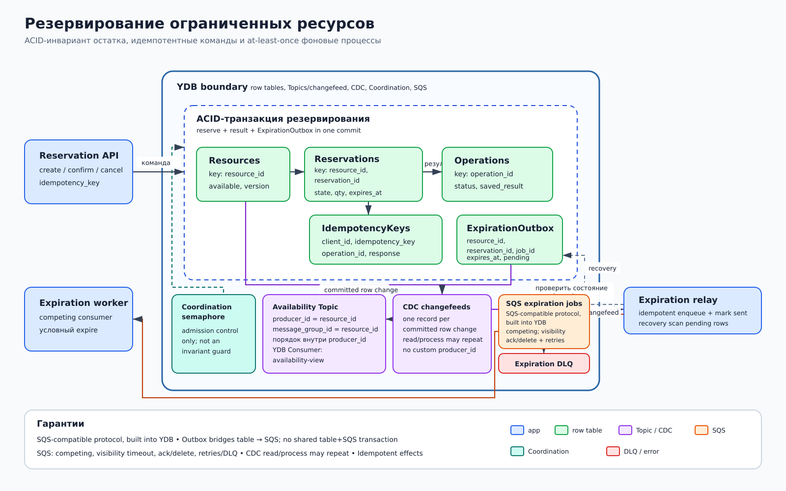

# Резервирование ограниченных ресурсов

## Назначение

Паттерн обеспечивает конкурентное резервирование единиц товара, мест, лимита или квоты без перепродажи. Инвариант доступности защищает одна ACID-транзакция YDB: она читает строку ресурса, проверяет остаток и одновременно фиксирует новый остаток и резервирование.

## Когда применять

- много клиентов одновременно претендуют на один ограниченный ресурс;
- подтверждение или отмена происходят позже первоначального запроса;
- повтор запроса из-за тайм-аута должен возвращать прежний результат;
- другим сервисам нужны события об изменении доступности.

## Компоненты

- **Reservation API** принимает команды создания, подтверждения и отмены.
- Row table **Resources**, ключ `resource_id`: общий лимит, доступный остаток и версия.
- Row table **Reservations**, ключ `(resource_id, reservation_id)`: количество, состояние, `expires_at` и версия.
- Row table **Operations**, ключ `operation_id`: состояние асинхронной операции и результат.
- Row table **IdempotencyKeys**, ключ `(client_id, idempotency_key)`: связь повторного запроса с операцией и сохраненный ответ.
- Row table **ExpirationOutbox**, ключ `(resource_id, reservation_id)`: неизменяемое намерение поставить проверку `expires_at`, payload и состояние relay.
- **YMQ expiration jobs** — отдельная SQS-совместимая очередь поверх YDB для competing consumers, обрабатывающих истечение резервов.
- **Expiration relay** читает changefeed `ExpirationOutbox`, идемпотентно ставит задания в YMQ и выполняет recovery scan необработанных строк.
- **CDC availability events** публикует изменения `Resources` в пользовательский Topic: `producer_id = message_group_id = resource_id`; гарантия порядка — «порядок внутри producer_id». Подписчики используют отдельные именованные **YDB Consumers**.
- **Coordination semaphore** ограничивает число одновременно допущенных запросов к горячему ресурсу.

## Основной поток

1. Клиент отправляет команду с `idempotency_key`; API находит или создает запись в `IdempotencyKeys`.
2. В одной ACID-транзакции API читает `Resources`, проверяет `available >= requested`, условно уменьшает остаток и создает `Reservations`, `Operations`, `IdempotencyKeys` и `ExpirationOutbox`.
3. Commit атомарно сохраняет резерв и намерение фоновой проверки; прямого enqueue после commit в критическом пути нет.
4. CDC создает одну change record на committed-вставку `ExpirationOutbox` в changefeed Topic. Relay может повторно прочитать или обработать record и идемпотентно ставит YMQ job; сбой между enqueue и отметкой relay может создать дубликат.
5. Consumer задания в транзакции проверяет текущее состояние и `expires_at`; только активный просроченный резерв переводится в `EXPIRED`, а остаток возвращается в `Resources`.
6. Отдельный changefeed `Resources` создает одну change record на committed-изменение доступности. Availability publisher пишет событие с `producer_id = message_group_id = resource_id`; порядок сохраняется внутри `producer_id`. Чтение и обработка могут повториться, поэтому каждый именованный YDB Consumer дедуплицирует события.
7. Подтверждение или отмена также выполняются условным переходом состояния и атомарным изменением остатка, если оно требуется.
8. Recovery scan relay периодически находит pending или зависшие строки `ExpirationOutbox` и повторяет enqueue с тем же идентификатором задания.

## Согласованность и надежность

Инвариант остатка принадлежит транзакции над `Resources` и `Reservations`. Атомарная запись `ExpirationOutbox` устраняет dual-write между commit резерва и enqueue YMQ. Coordination не заменяет ACID и не защищает инвариант: semaphore служит только admission control. Идемпотентность команд опирается на уникальный ключ, а обработчики YMQ и событий допускают повторную доставку. Все внешние эффекты идемпотентны.

CDC создает одну change record на каждое committed изменение исходной строки в changefeed Topic. Это не гарантирует однократную обработку: после переподключения record может быть повторно прочитан или обработан, поэтому enqueue, публикация и именованные YDB Consumers используют стабильный event/job id.

TTL используется только для фоновой очистки окончательных строк и старых ключей идемпотентности. TTL не является точным таймером и не должен инициировать возврат ресурса; решение об истечении принимает worker по серверному времени и состоянию строки.

## Масштабирование и ключи партиционирования

API, expiration relay и workers масштабируются горизонтально. Полные `resource_id`, `reservation_id` и `client_id` остаются частью первичного ключа и идентичности. Если нужен дополнительный shard prefix, ключи имеют вид `(resource_shard, resource_id, ...)` или `(client_shard, client_id, ...)`; hash-only identity недопустима. Популярный ресурс остается горячим бизнес-ключом, поэтому semaphore или разбиение самого лимита на бакеты уменьшают давление, не меняя защиту инварианта. YMQ масштабирует competing consumers, а Topic — независимые именованные YDB Consumers.

## Отказы и восстановление

- Потеря ответа после commit приводит к повтору команды; `IdempotencyKeys` возвращает сохраненный результат.
- Остановка relay после commit не теряет задание: changefeed остается доступным, а recovery scan находит pending-строку `ExpirationOutbox`.
- Сбой relay после enqueue, но до отметки строки создает допустимый дубликат с тем же job id.
- Дубликат expiration job безопасен: условный переход из `ACTIVE` выполняется один раз.
- Раннее или задержанное задание перечитывает `expires_at`; при необходимости создается повторная попытка.
- Недоступный именованный YDB Consumer возобновляет чтение Topic со своей сохраненной позиции.
- Сбой держателя semaphore не портит остаток: Coordination освобождает сессию, а транзакционные данные остаются источником истины.

## Ограничения и антипаттерны

- Нельзя сначала прочитать остаток, а затем изменить его отдельным запросом.
- Нельзя считать lease, semaphore, TTL или доставку YMQ доказательством права на ресурс.
- Нельзя выполнять необратимый внешний эффект до commit без идемпотентного протокола.
- Нельзя использовать эту схему для DWH/OLAP или реляционной аналитики.
- Здесь не применяются column tables и YDB External Data Source.
