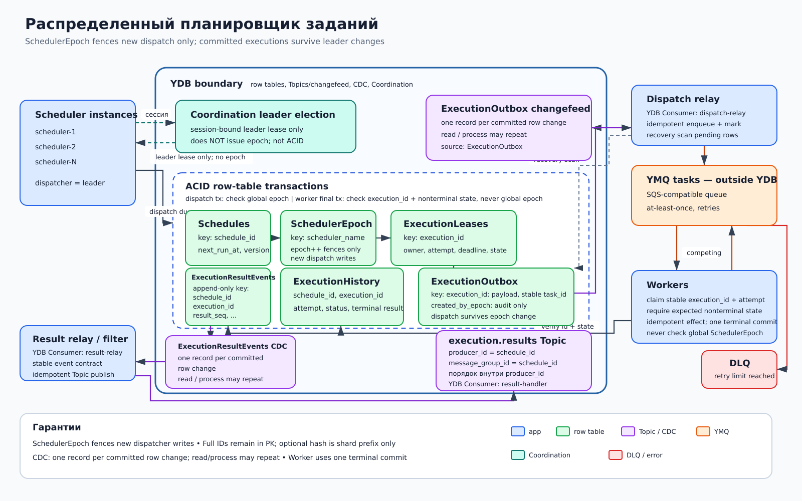

# Распределенный планировщик заданий

## Назначение

Паттерн запускает задания по расписанию при нескольких экземплярах scheduler и пуле workers. Leader election упрощает диспетчеризацию, а `SchedulerEpoch` отсекает транзакции устаревшего dispatcher только при создании новых executions и продвижении `next_run_at`. Транзакционная запись уникального `execution_id` является истинной защитой от повторного создания одного запуска.

## Когда применять

- расписаний больше, чем способен обслужить один процесс;
- требуется автоматический failover dispatcher;
- задания выполняются отдельным масштабируемым пулом;
- допустима at-least-once доставка при контролируемых повторах выполнения.

## Компоненты

- Row table **Schedules**, ключ `schedule_id`: правило, `next_run_at`, состояние и версия.
- Row table **SchedulerEpoch**, ключ `scheduler_name`: текущий монотонный epoch dispatcher.
- Row table **ExecutionLeases**, ключ `execution_id`: владелец, номер и срок попытки, ожидаемое нетерминальное состояние.
- Row table **ExecutionHistory**, ключ `(schedule_id, execution_id)`: запланированное время, попытки и итог.
- Append-only row table **ExecutionResultEvents**, ключ `(schedule_id, execution_id, result_seq)`: версия результата, статус и payload события.
- Row table **ExecutionOutbox**, ключ `execution_id`: payload задачи, стабильный task id, состояние relay и неизменяемый `created_by_epoch` только для аудита.
- Несколько **scheduler instances** сканируют сроки; выбранный dispatcher создает исполнения.
- **Coordination leader election** предоставляет только session-bound leader lease. Coordination не выдает epoch и не заменяет ACID.
- **Execution relay** читает changefeed `ExecutionOutbox` как именованный `YDB Consumer: execution-dispatch-relay`, ставит задачи в YMQ и выполняет recovery scan pending или зависших строк.
- **YMQ tasks** — отдельная SQS-совместимая очередь поверх YDB для competing consumers.
- **Workers** выполняют задания и атомарно обновляют `ExecutionHistory` вместе с добавлением `ExecutionResultEvents`.
- **Result relay/filter** читает CDC только `ExecutionResultEvents` как именованный `YDB Consumer: execution-result-relay`, отбирает контрактные события и публикует их в Topic **`execution.results`** с `producer_id = message_group_id = schedule_id`; гарантия порядка — «порядок внутри producer_id». Получатели используют собственные именованные YDB Consumers.
- Политика retries повторно ставит временно неуспешные задачи, а исчерпанные попытки направляет в красный **DLQ**.

## Основной поток

1. Scheduler instances получают session-bound leader lease в Coordination; сам lease не содержит и не создает epoch.
2. Новый лидер отдельной ACID-транзакцией условно увеличивает строку `SchedulerEpoch` и использует возвращенное committed-значение как свой epoch.
3. Dispatcher читает наступившие строки `Schedules` и для каждого интервала детерминированно вычисляет `execution_id` из `schedule_id` и планового времени.
4. Одна условная транзакция проверяет равенство текущего `SchedulerEpoch`, резервирует уникальный `execution_id`, создает `ExecutionHistory`, `ExecutionLeases` и `ExecutionOutbox`, затем передвигает `next_run_at`.
5. CDC создает одну change record на committed-вставку `ExecutionOutbox` в changefeed Topic. Dispatch relay может повторно прочитать или обработать record, поэтому идемпотентно ставит задачу в YMQ; recovery scan повторяет enqueue для pending или зависших строк.
6. Один из competing workers получает задачу и условно захватывает попытку в `ExecutionLeases`, проверяя стабильный `execution_id`, ожидаемое нетерминальное состояние и номер попытки. Worker не сравнивает `created_by_epoch` задачи с текущим глобальным `SchedulerEpoch`.
7. Перед commit результата worker снова транзакционно проверяет `execution_id`, актуальную попытку и ожидаемое нетерминальное состояние. Условный переход в terminal state побеждает один раз; в той же ACID-транзакции worker обновляет `ExecutionHistory` и append-only добавляет `ExecutionResultEvents` с очередным `result_seq`.
8. CDC именно `ExecutionResultEvents` создает одну change record на committed-вставку в changefeed Topic. Result relay/filter может повторно прочитать или обработать record, преобразует его в стабильный контракт и публикует в `execution.results` с `producer_id = message_group_id = schedule_id`; порядок сохраняется внутри `producer_id`, а повтор publish дедуплицируется по `(schedule_id, execution_id, result_seq)`.
9. Временная ошибка приводит к retry с тем же `execution_id`; смена глобального epoch не инвалидирует уже созданное исполнение. После лимита сообщение и контекст направляются в DLQ.

## Согласованность и надежность

Lease сам по себе не доказывает уникальность выполнения: пауза процесса или сетевое разделение оставляют старого worker активным. Истинная защита создания запуска — уникальная условная транзакционная запись `execution_id`. `SchedulerEpoch` транзакционно увеличивается новым лидером и проверяется только транзакциями scheduler/dispatcher, которые резервируют новые execution или продвигают `next_run_at`. Session-bound leader lease Coordination лишь определяет кандидата на лидерство.

Атомарно созданная пара `ExecutionHistory` + `ExecutionOutbox` остается легитимной после смены лидера. Relay продолжает dispatch и retry такой строки независимо от текущего `SchedulerEpoch`; иначе смена лидера потеряла бы уже зафиксированные задания. Атомарная запись `ExecutionHistory` и `ExecutionResultEvents` не оставляет окна между финальным состоянием и намерением опубликовать результат. Доставка YMQ и публикация в `execution.results` рассматриваются как at-least-once. Обработчики и все внешние эффекты идемпотентны по `execution_id` и номеру шага. Coordination не заменяет ACID-транзакции YDB.

CDC создает одну change record в changefeed Topic на каждое committed изменение исходной строки. Для результатов исходной таблицей является только append-only `ExecutionResultEvents`, а не вся `ExecutionHistory`. Чтение или обработка именованным YDB Consumer может повториться, поэтому dispatch и result event дедуплицируются по стабильному идентификатору.

## Масштабирование и ключи партиционирования

Полные `schedule_id` и `execution_id` всегда сохраняются в первичных ключах и сообщениях. Для распределения допустим только дополнительный shard prefix: например, `(execution_shard, execution_id)` или `(schedule_shard, schedule_id, execution_id, result_seq)`; hash-only identity запрещена. Для выборки сроков используется временной bucket с последующим подтверждением полной строки в транзакции. Dispatch relay, result relay и workers масштабируются независимо, YMQ распределяет задачи между competing consumers, а `execution.results` обслуживают независимые именованные YDB Consumers.

## Отказы и восстановление

- После потери session-bound lease Coordination выбирает нового лидера; новый лидер сам транзакционно увеличивает `SchedulerEpoch`. Новые scheduler-транзакции старого epoch отклоняются, но ранее committed `ExecutionHistory` и `ExecutionOutbox` продолжают dispatch и выполнение.
- Commit мог пройти до тайм-аута: повтор с тем же `execution_id` обнаруживает существующую историю.
- Остановка relay после commit не теряет задачу: recovery scan находит `ExecutionOutbox`; сбой после enqueue создает допустимый дубликат.
- Worker может завершить внешний эффект и не записать результат; повтор исполнения возможен, поэтому эффект обязан быть идемпотентным.
- Истекший worker lease разрешает новую попытку, но не останавливает старый процесс; проверка `execution_id`, номера попытки и ожидаемого нетерминального состояния допускает только один terminal commit.
- Сбой result relay после publish, но до фиксации позиции может повторить событие; стабильный ключ `ExecutionResultEvents` делает повтор безопасным.
- Недоступный именованный YDB Consumer дочитывает `execution.results` со своей сохраненной позиции, а сообщения DLQ разбираются и переотправляются оператором после устранения причины.

## Ограничения и антипаттерны

- Нельзя считать leader lease или worker lease гарантией однократного выполнения.
- Нельзя генерировать случайный `execution_id` при каждом повторе одного планового интервала.
- Нельзя принимать запись от dispatcher без проверки epoch.
- Нельзя отклонять уже поставленную задачу только потому, что ее `created_by_epoch` меньше текущего `SchedulerEpoch`.
- Нельзя публиковать всю `ExecutionHistory` как готовый result Topic: это mutable operational state, а не append-only интеграционный контракт.
- Нельзя бесконечно повторять постоянную ошибку без лимита и DLQ.
- Решение не предназначено для DWH/OLAP и реляционной аналитики; column tables и YDB External Data Source не используются.
