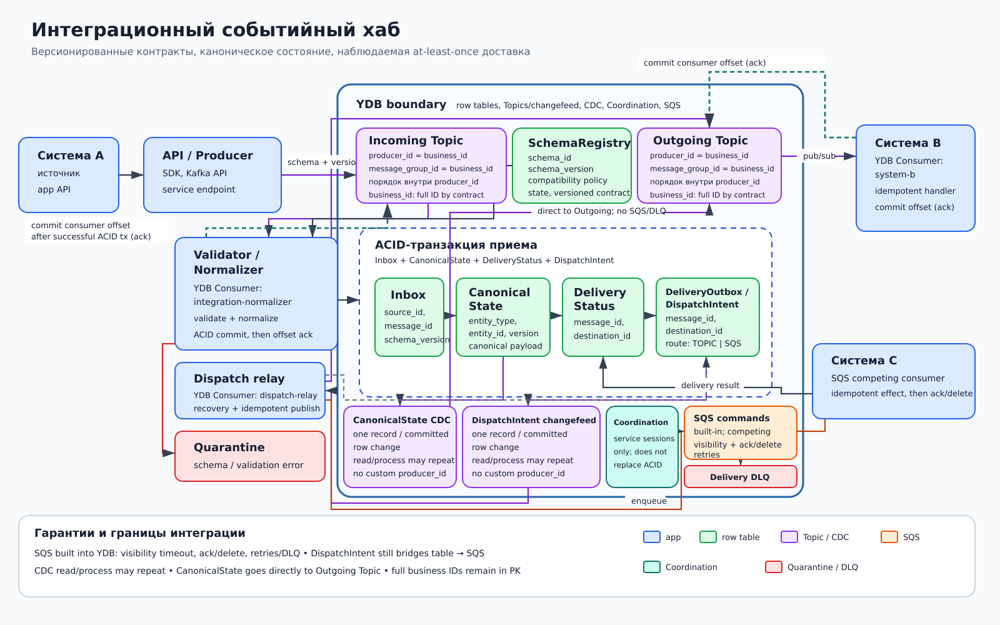

# Интеграционный событийный хаб

## Назначение

Паттерн связывает системы через управляемый событийный контур: входные сообщения проверяются и нормализуются, каноническое состояние и статус доставки фиксируются в YDB, затем события или команды передаются целевым системам. Он отделяет форматы источников от контрактов получателей и делает повторы наблюдаемыми.

## Когда применять

- несколько систем обмениваются событиями и командами с разными контрактами;
- нужна единая валидация, версионирование схем и карантин;
- необходимо отслеживать прием, преобразование и доставку каждого сообщения;
- изменения row tables должны публиковаться через CDC.

## Компоненты

- Исходные и целевые **системы** подключаются только через app API, producers и consumers.
- **Incoming Topics** принимают события по SDK или Kafka API; при записи `producer_id = message_group_id = <business_id>`, обычно полному `entity_id` или `source_id`.
- **Validator/Normalizer** снаружи YDB читает Incoming Topic как именованный `YDB Consumer: integration-normalizer`, проверяет envelope и версию схемы, затем преобразует payload в канонический контракт.
- Row table **SchemaRegistry**, ключ `(schema_id, schema_version)`: контракт, состояние версии и policy совместимости.
- Row table **Inbox**, ключ `(source_id, message_id)`: дедупликация, версия схемы и результат проверки.
- Row table **CanonicalState**, ключ `(entity_type, entity_id)`: актуальная каноническая версия сущности.
- Row table **DeliveryStatus**, ключ `(message_id, destination_id)`: состояние, попытка и последняя ошибка.
- Row table **DeliveryOutbox/DispatchIntent**, ключ `(message_id, destination_id)`: тип маршрута `TOPIC` или `YMQ`, payload, стабильный event/command id и состояние relay.
- **Outgoing Topics** доставляют события подписчикам по модели pub/sub; каждый получатель использует собственный именованный YDB Consumer.
- **YMQ commands** — отдельная SQS-совместимая очередь поверх YDB для competing consumers, выполняющих адресные команды.
- **Dispatch relay** находится снаружи YDB, читает changefeed именованным YDB Consumer, публикует намерения доставки и выполняет recovery scan pending или зависших `DispatchIntent`.
- **CDC CanonicalState** напрямую образует outgoing changefeed Topic, когда источником события является изменение row table.
- **Quarantine/DLQ** хранит невалидные сообщения и доставки, исчерпавшие повторы.
- **Schema Registry/Policy** управляет поддерживаемыми версиями и правилами совместимости.

## Основной поток

1. Producer исходной системы отправляет envelope с полными `source_id`, `message_id`, `entity_type`, `entity_id`, `schema_id` и `schema_version` во входной Topic через SDK, Kafka API или service endpoint. Для порядка бизнес-сущности он задает `producer_id = message_group_id = entity_id`; при отсутствии сущности используется полный `source_id`.
2. Validator читает сообщение как именованный `YDB Consumer: integration-normalizer`, получает policy из `SchemaRegistry` и проверяет контракт. Неизвестная версия или невалидный payload направляются в quarantine с причиной.
3. Normalizer одной ACID-транзакцией условно создает `Inbox`, обновляет `CanonicalState` и атомарно записывает `DeliveryStatus` вместе с `DeliveryOutbox/DispatchIntent`; повторный `(source_id, message_id)` возвращает сохраненный результат. Только после успешного commit Validator фиксирует consumer offset (ack); при сбое до ack сообщение читается повторно.
4. Для событий, источником которых является изменение `CanonicalState`, CDC создает одну change record на committed row change в outgoing changefeed Topic. Путь идет напрямую `CanonicalState → CDC → Outgoing Topics`, без YMQ и DLQ.
5. Для явных адресных маршрутов CDC создает одну change record на committed-вставку `DispatchIntent`; dispatch relay может повторно прочитать или обработать record и идемпотентно публикует событие в заданный outgoing Topic либо ставит команду в YMQ. Topic writer использует `producer_id = message_group_id = <business_id>`.
6. Каждый Topic-получатель читает через собственный именованный YDB Consumer, идемпотентно применяет сообщение и затем фиксирует consumer offset (ack). YMQ-команды получают competing consumers.
7. Результат адресной доставки условно записывается в `DeliveryStatus`; временная ошибка повторяется, постоянная или исчерпавшая лимит попадает в DLQ соответствующего маршрута.
8. Recovery scan relay периодически находит pending или зависшие `DispatchIntent` и повторяет publish/enqueue с тем же event/command id.

## Согласованность и надежность

Транзакция YDB атомарно связывает дедупликацию Inbox, изменение канонического состояния, статус и `DispatchIntent`; это устраняет dual-write между commit состояния и publish/enqueue. Coordination при необходимости координирует краткие служебные операции, но не заменяет ACID. Topics и YMQ допускают повторную доставку; все именованные YDB Consumers и внешние эффекты идемпотентны по полным `(source_id, message_id, destination_id)`.

CDC создает одну change record в changefeed Topic на каждое committed изменение исходной строки. Чтение или обработка record после сбоя может повториться; dispatch relay и именованные YDB Consumers используют стабильный event/command id. Эта гарантия не означает однократный внешний эффект.

Версия схемы находится в envelope, проверяется по `SchemaRegistry` и сохраняется в Inbox. Изменения контракта проходят policy совместимости; миграции normalizer поддерживают ограниченное окно версий. Ошибка отдельного получателя не блокирует остальных.

## Масштабирование и ключи партиционирования

Для Topics используется `producer_id = message_group_id = <business_id>`: полный `entity_id` для порядка сущности либо полный `message_id` для независимых сообщений. Полные `source_id`, `entity_type`, `entity_id`, `message_id` и `destination_id` сохраняются в таблицах и envelope. Допустим только дополнительный shard prefix, например `(message_shard, source_id, message_id)` или `(entity_shard, entity_type, entity_id)`; hash-only identity запрещена. Validator, normalizer, dispatch relay и именованные YDB Consumers масштабируются независимо; YMQ распределяет команды между competing consumers.

## Отказы и восстановление

- Повтор входного сообщения обнаруживается по ключу Inbox и не создает второе изменение состояния.
- После commit до подтверждения именованный YDB Consumer перечитывает сообщение и продолжает по сохраненному Inbox; затем повторно фиксирует offset.
- Остановка relay после commit не теряет намерение: changefeed сохраняет record, а recovery scan находит pending `DispatchIntent`.
- Сбой relay после publish/enqueue, но до отметки строки создает допустимый дубликат с тем же идентификатором.
- Неизвестная схема остается в quarantine до добавления безопасного преобразования и контролируемого replay.
- Недоступный именованный YDB Consumer восстанавливает чтение Topic со своей сохраненной позиции или получает повтор YMQ.
- DLQ сохраняет исходный envelope, назначение и диагностику; replay выполняется с тем же идентификатором после исправления причины.

## Ограничения и антипаттерны

- Интеграция выполняется только через SDK, Kafka API и service endpoints. **YDB External Data Source явно не используется.**
- Нельзя давать системам прямой доступ к внутренним таблицам друг друга.
- Нельзя менять смысл существующей версии схемы или терять исходный `message_id`.
- Нельзя полагаться на однократную доставку вместо идемпотентности получателя.
- Хаб не является DWH/OLAP и средством реляционной аналитики; column tables не используются.
