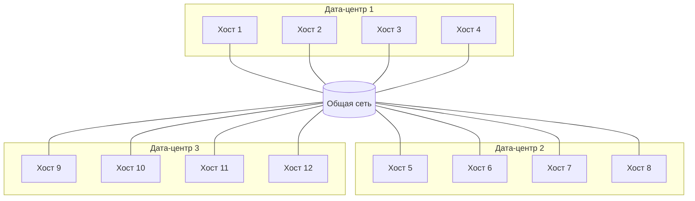

```mermaid
flowchart TB
  %% Верхний дата-центр
  subgraph DC1[Дата-центр 1]
    direction TB
    H1[Хост 1]
    H2[Хост 2]
    H3[Хост 3]
    H4[Хост 4]
  end

  %% Общая сеть по центру
  NET[(Общая сеть)]

  %% Два дата-центра внизу (без общего контейнера)
  subgraph DC2[Дата-центр 2]
    direction TB
    H5[Хост 5]
    H6[Хост 6]
    H7[Хост 7]
    H8[Хост 8]
  end

  subgraph DC3[Дата-центр 3]
    direction TB
    H9[Хост 9]
    H10[Хост 10]
    H11[Хост 11]
    H12[Хост 12]
  end

  %% Подключения к общей сети
  H1 --- NET
  H2 --- NET
  H3 --- NET
  H4 --- NET

  NET --- H5
  NET --- H6
  NET --- H7
  NET --- H8

  NET --- H9
  NET --- H10
  NET --- H11
  NET --- H12
```
