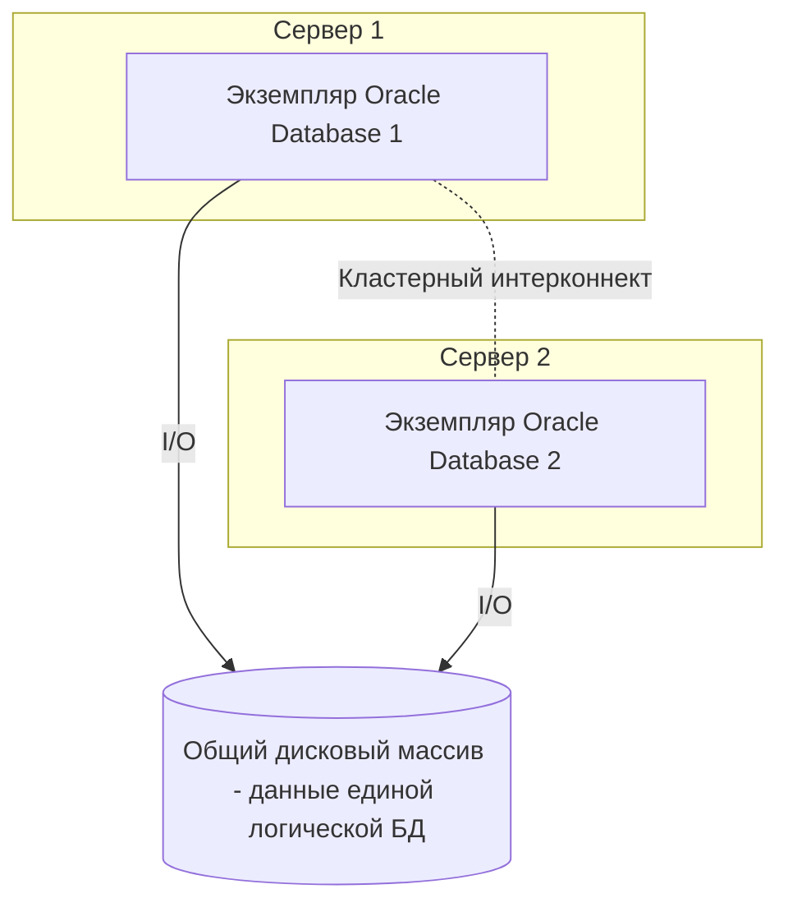
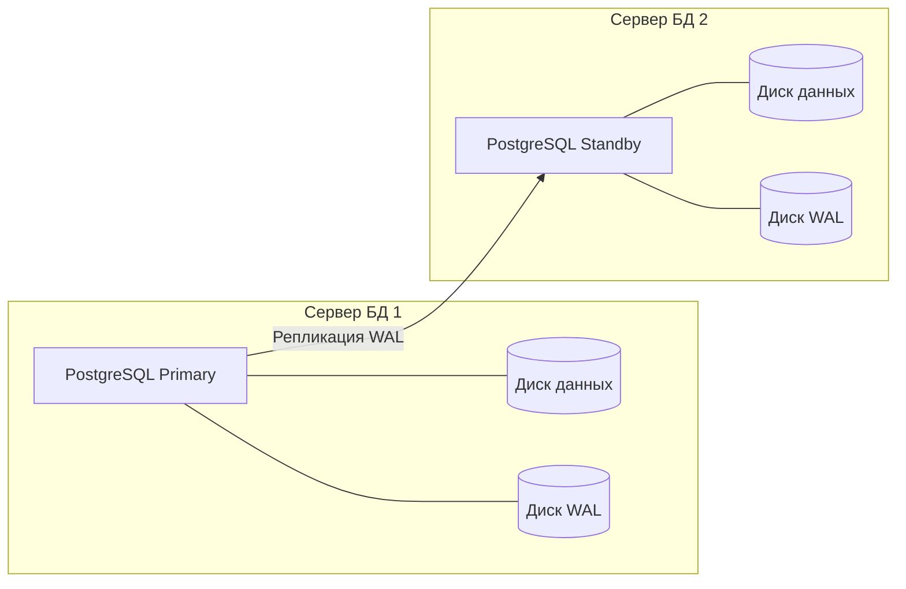
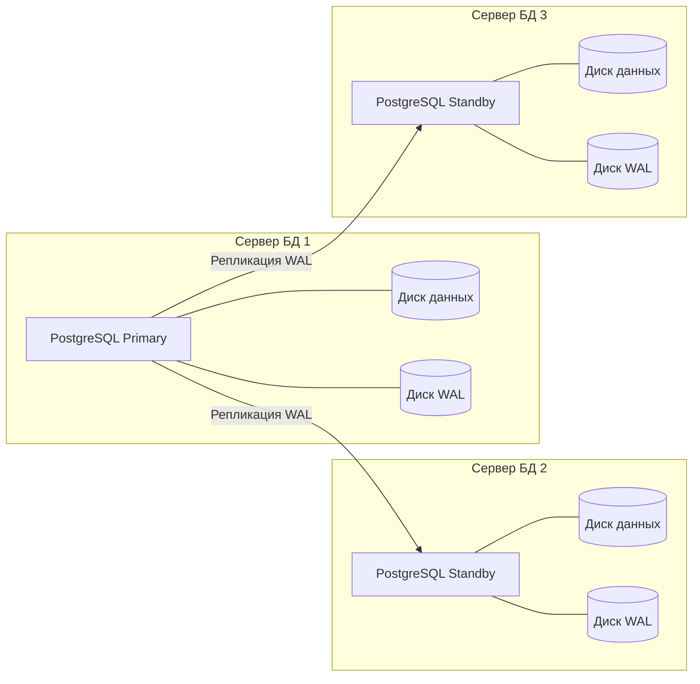

```mermaid
flowchart TB
  %% Узлы кластера
  subgraph S1[Сервер 1]
    direction TB
    I1[Экземпляр Oracle Database 1]
  end

  subgraph S2[Сервер 2]
    direction TB
    I2[Экземпляр Oracle Database 2]
  end

  %% Общая СХД с файлами единой БД
  SA[(Общий дисковый массив - данные единой логической БД)]

  %% Доступ экземпляров к общему диску
  I1 -->|I/O| SA
  I2 -->|I/O| SA

  %% Межузловое взаимодействие (RAC interconnect / Cache Fusion)
  I1 -. Кластерный интерконнект .- I2
```

```mermaid
flowchart LR
  %% Сервер с primary-узлом
  subgraph S1[Сервер БД 1]
    direction TB
    P[PostgreSQL Primary]
    D1[(Диск данных)]
    W1[(Диск WAL)]
    P --- D1
    P --- W1
  end

  %% Сервер со standby-узлом
  subgraph S2[Сервер БД 2]
    direction TB
    S[PostgreSQL Standby]
    D2[(Диск данных)]
    W2[(Диск WAL)]
    S --- D2
    S --- W2
  end

  %% Направление репликации
  P -- Репликация WAL --> S

```

************

```mermaid
flowchart LR
  %% Сервер с primary-узлом
  subgraph S1[Сервер БД 1]
    direction TB
    P[PostgreSQL Primary]
    D1[(Диск данных)]
    W1[(Диск WAL)]
    P --- D1
    P --- W1
  end

  %% Сервер со standby-узлом 1
  subgraph S2[Сервер БД 2]
    direction TB
    S[PostgreSQL Standby]
    D2[(Диск данных)]
    W2[(Диск WAL)]
    S --- D2
    S --- W2
  end

  %% Сервер со standby-узлом 2
  subgraph S3[Сервер БД 3]
    direction TB
    S3N[PostgreSQL Standby]
    D3[(Диск данных)]
    W3[(Диск WAL)]
    S3N --- D3
    S3N --- W3
  end

  %% Направление репликации
  P -- Репликация WAL --> S
  P -- Репликация WAL --> S3N

```
