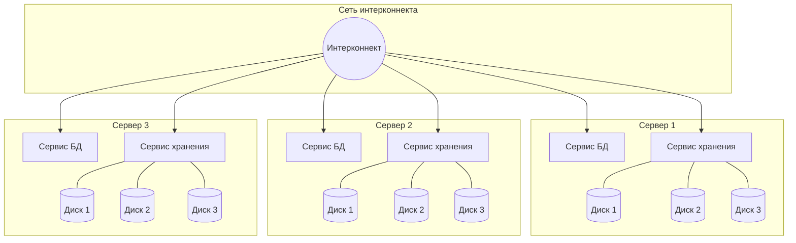
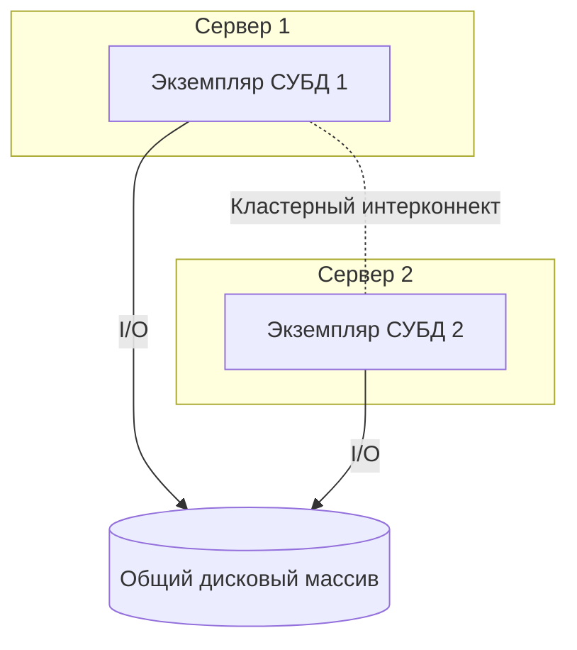
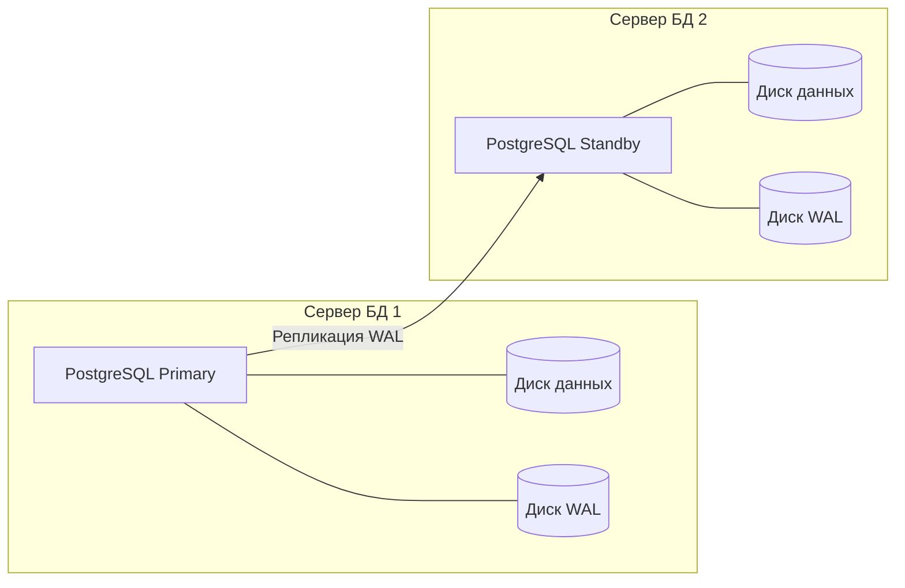
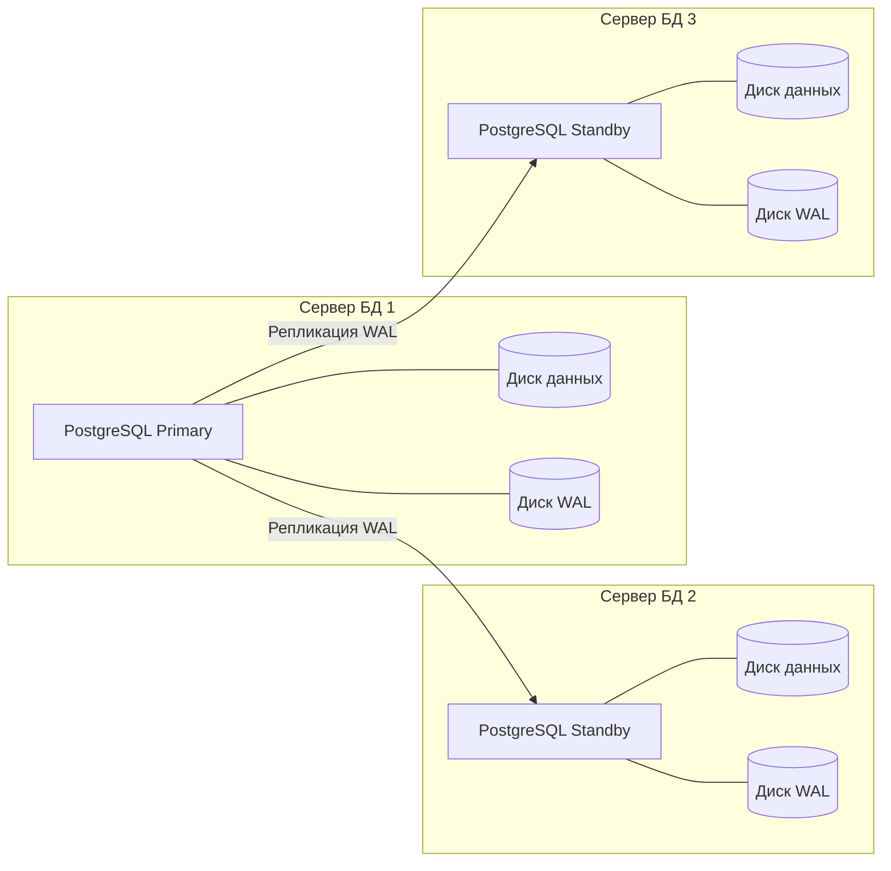

```mermaid
flowchart TB
  %% Интерконнект сверху
  subgraph NET[Сеть интерконнекта]
    direction LR
    IC((Интерконнект))
  end

  %% Сервера внизу слева направо (без общего блока)
  subgraph S1[Сервер 1]
    direction TB
    S1DB[Сервис БД]
    S1ST[Сервис хранения]
    S1D1[(Диск 1)]
    S1D2[(Диск 2)]
    S1D3[(Диск 3)]
    S1ST --- S1D1
    S1ST --- S1D2
    S1ST --- S1D3
  end

  subgraph S2[Сервер 2]
    direction TB
    S2DB[Сервис БД]
    S2ST[Сервис хранения]
    S2D1[(Диск 1)]
    S2D2[(Диск 2)]
    S2D3[(Диск 3)]
    S2ST --- S2D1
    S2ST --- S2D2
    S2ST --- S2D3
  end

  subgraph S3[Сервер 3]
    direction TB
    S3DB[Сервис БД]
    S3ST[Сервис хранения]
    S3D1[(Диск 1)]
    S3D2[(Диск 2)]
    S3D3[(Диск 3)]
    S3ST --- S3D1
    S3ST --- S3D2
    S3ST --- S3D3
  end

  %% Подключение всех сервисов к интерконнекту (сверху вниз)
  IC --> S1DB
  IC --> S1ST
  IC --> S2DB
  IC --> S2ST
  IC --> S3DB
  IC --> S3ST
```

********************

```mermaid
flowchart TB
  %% Узлы кластера
  subgraph S1[Сервер 1]
    direction TB
    I1[Экземпляр СУБД 1]
  end

  subgraph S2[Сервер 2]
    direction TB
    I2[Экземпляр СУБД 2]
  end

  %% Общая СХД с файлами единой БД
  SA[(Общий дисковый массив)]

  %% Доступ экземпляров к общему диску
  I1 -->|I/O| SA
  I2 -->|I/O| SA

  %% Межузловое взаимодействие (RAC interconnect / Cache Fusion)
  I1 -. Кластерный интерконнект .- I2
```

******************

```mermaid
flowchart LR
  %% Сервер с primary-узлом
  subgraph S1[Сервер БД 1]
    direction TB
    P[PostgreSQL Primary]
    D1[(Диск данных)]
    W1[(Диск WAL)]
    P --- D1
    P --- W1
  end

  %% Сервер со standby-узлом
  subgraph S2[Сервер БД 2]
    direction TB
    S[PostgreSQL Standby]
    D2[(Диск данных)]
    W2[(Диск WAL)]
    S --- D2
    S --- W2
  end

  %% Направление репликации
  P -- Репликация WAL --> S

```

************

```mermaid
flowchart LR
  %% Сервер с primary-узлом
  subgraph S1[Сервер БД 1]
    direction TB
    P[PostgreSQL Primary]
    D1[(Диск данных)]
    W1[(Диск WAL)]
    P --- D1
    P --- W1
  end

  %% Сервер со standby-узлом 1
  subgraph S2[Сервер БД 2]
    direction TB
    S[PostgreSQL Standby]
    D2[(Диск данных)]
    W2[(Диск WAL)]
    S --- D2
    S --- W2
  end

  %% Сервер со standby-узлом 2
  subgraph S3[Сервер БД 3]
    direction TB
    S3N[PostgreSQL Standby]
    D3[(Диск данных)]
    W3[(Диск WAL)]
    S3N --- D3
    S3N --- W3
  end

  %% Направление репликации
  P -- Репликация WAL --> S
  P -- Репликация WAL --> S3N

```
