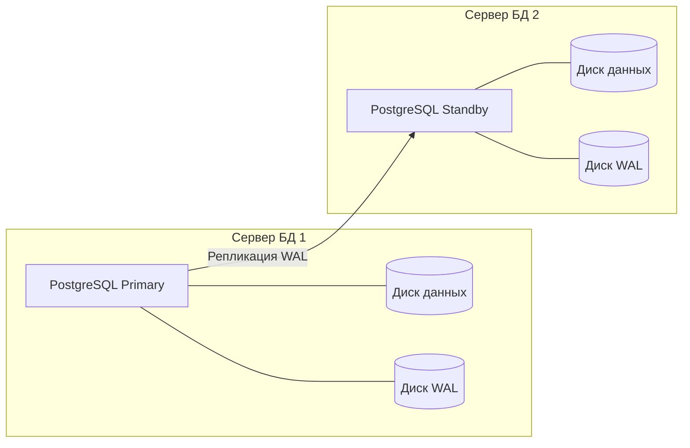

```mermaid
flowchart LR
  %% Сервер с primary-узлом
  subgraph S1[Сервер БД 1]
    direction TB
    P[PostgreSQL Primary]
    D1[(Диск данных)]
    W1[(Диск WAL)]
    P --- D1
    P --- W1
  end

  %% Сервер со standby-узлом
  subgraph S2[Сервер БД 2]
    direction TB
    S[PostgreSQL Standby]
    D2[(Диск данных)]
    W2[(Диск WAL)]
    S --- D2
    S --- W2
  end

  %% Направление репликации
  P -- Репликация WAL --> S

```
